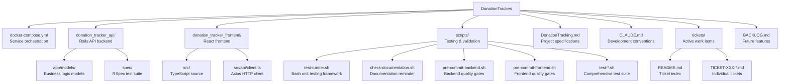
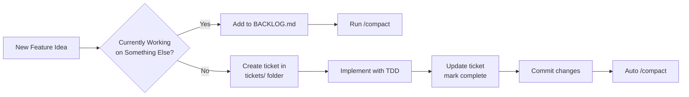

# Claude Development Conventions & Best Practices

*Guidelines for maintaining consistent development practices in the Donation Tracker project*

---

## 🏗️ Project Structure & Repository Strategy

### Monorepo with Service Separation
- **Single repository** containing both backend and frontend
- **Service-separated commits** for clear development history
- **Independent development** workflows per service
- **Atomic feature commits** when features span both services

### Directory Structure



---

## 📋 Ticket & Task Management System

### Active Work Tracking
**Location:** `tickets/` directory
- Each ticket in its own file: `TICKET-XXX-descriptive-slug.md`
- Current user stories and tasks being actively developed
- Detailed acceptance criteria and technical notes
- Links to commits and files changed
- Use `/memory` to access during Claude Code sessions
- Index available at `tickets/README.md`

### Feature Backlog
**File:** `BACKLOG.md`
- Future feature ideas and enhancements
- Prioritized by business value and effort
- Log ideas here when discovered during development
- Review periodically to plan next work

### Workflow



### Benefits
- **Context Persistence:** Tickets survive `/compact` (external files)
- **Clean Context:** Compact after logging backlog items to remove distractions
- **Async Feature Capture:** Don't lose ideas while focused on current work
- **Historical Record:** Track what was built and why
- **Claude Code Integration:** Use `/memory` to access ticket context

### Best Practices
1. **Create ticket BEFORE starting work** - Clarifies goals and acceptance criteria
2. **Update tickets as you work** - Track progress and decisions
3. **Compact after backlog entries** - Especially when discovered mid-task
4. **One ticket = One vertical slice** - Complete feature through all layers
5. **Link commits to tickets** - Maintains traceability

### Ticket File Template

Each ticket is stored in `tickets/TICKET-XXX-descriptive-slug.md` format.

```markdown
## [TICKET-XXX] Ticket Title

**Status:** 🔵 In Progress | ⏸️ Blocked | ✅ Complete | 📋 Planned
**Priority:** 🔴 High | 🟡 Medium | 🟢 Low
**Started:** YYYY-MM-DD
**Completed:** YYYY-MM-DD (if done)
**Dependencies:** TICKET-XXX, TICKET-YYY (if any)

### User Story
As a [user type], I want [goal] so that [benefit].

### Acceptance Criteria
- [ ] Criterion 1
- [ ] Criterion 2
- [ ] Criterion 3

### Technical Notes
- Implementation details
- Dependencies
- Breaking changes

### Files Changed
- `path/to/file.rb`
- `path/to/file.tsx`

### Related Commits
- `commit-hash`: Description
```

### Example: Completed Ticket

See [TICKET-001: Donor Soft Delete with Archive/Restore](tickets/TICKET-001-donor-soft-delete-archive-restore.md) for a complete example.

---

## 📊 Documentation & Diagram Standards

### Mermaid Diagram Requirements
- **All diagrams MUST use Mermaid format** for consistency and maintainability
- **No ASCII art or text trees** - convert to proper Mermaid syntax
- **Version controllable** - diagrams stored as code alongside documentation
- **GitHub rendering** - automatically renders in markdown files and PRs

### Supported Diagram Types
- **Flowcharts**: Project structure, workflows, decision trees
- **Sequence Diagrams**: API interactions, authentication flows
- **Git Graphs**: Branch strategies, commit workflows
- **Entity Relationship Diagrams**: Database schema, model relationships
- **User Journey Maps**: Feature workflows, user interactions

### Mermaid Benefits
- **IDE Support**: Syntax highlighting and preview in VS Code
- **Maintainable**: Easy to update as code changes
- **Consistent**: Uniform styling across all documentation
- **Professional**: Clean, standardized visual representation

### Example Usage


---

## 📝 Commit Message Conventions

### Required Prefixes
- `backend:` - Rails API changes, models, controllers, gems
- `frontend:` - React components, TypeScript, styling, client logic
- `docker:` - Container configuration, docker-compose changes
- `docs:` - Documentation updates, README changes
- `feat:` - Cross-cutting features spanning multiple services
- `fix:` - Bug fixes across services
- `chore:` - Maintenance tasks, dependency updates

### Commit Message Format
```
<prefix>: <concise description>

- Detailed explanation of changes
- Why this change was necessary
- Any breaking changes or migration notes

```

### ⚠️ MANDATORY PRE-COMMIT RULE
**ALWAYS update DonationTracking.md and CLAUDE.md before ANY commit**
- Document new features, tools, dependencies, and decisions
- Keep architecture diagrams and usage examples current
- Update version numbers and configuration details
- Reflect changes in completed work sections

### Examples
```bash
backend: add User model with username validation
frontend: create responsive donation form component
docker: fix PostgreSQL connection in test environment
feat: implement end-to-end donation workflow
```

---

## 🧪 Test-Driven Development (TDD) - 2025 Enhanced Methodology

### Strict TDD Workflow (Single Test Rule)
1. **Red**: Write ONLY ONE failing test at a time
   - No multiple tests during red phase
   - Must fail for the right reason
   - Clear, descriptive test name (reads like plain English)
2. **Green**: Write minimal code to make ONLY that test pass
   - No over-engineering
   - Simplest possible implementation
3. **Refactor**: When ALL tests are passing, improve code OR tests
   - **Code Refactoring**: Check for code smells and design pattern opportunities
   - **Test Refactoring**: Improve clarity, remove duplication, better organization
   - **Functionality Preservation**: Must maintain all existing functionality during refactoring
   - **Convention Adherence**: Ensure established patterns are followed
4. **Repeat**: Continue with next single test

#### TDD Workflow Visualization

```mermaid
flowchart LR
    A[🔴 RED<br/>Write ONE failing test] --> B[🟢 GREEN<br/>Minimal code to pass]
    B --> C[🔵 REFACTOR<br/>Improve code/tests]
    C --> D[All tests pass?]
    D -->|Yes| A
    D -->|No| E[🔧 Fix issues]
    E --> C

    style A fill:#ffcccc
    style B fill:#ccffcc
    style C fill:#ccccff
    style E fill:#fff2cc
```



### One Expectation Rule
- Each test should make only ONE assertion
- Helps identify specific failures quickly
- Makes tests more readable and focused
- Example: Test validation separately from business logic

### Bug Prevention Protocol
- **Bug Discovery**: Any bug found MUST have a test written FIRST
- **Test-First Bug Fixes**: Follow full TDD cycle for bug resolution
  1. Write failing test that reproduces the bug
  2. Fix the bug with minimal code
  3. Refactor if needed
- **Regression Prevention**: Test ensures bug cannot resurface in future

### Backend Testing Stack
- **RSpec**: Primary testing framework
- **Factory Bot**: Test data generation
- **Faker**: Realistic test data
- **SimpleCov**: Coverage reporting (minimum 90%)
- **Shoulda Matchers**: Clean model validations
- **Database Cleaner**: Test isolation
- **WebMock + VCR**: HTTP request mocking

### Frontend Testing Stack
- **Jest**: Unit testing framework (v27.5.1, via react-scripts)
- **Vitest**: Modern testing alternative (v1.6.1) with UI dashboard
- **React Testing Library**: Component testing (v16.3.0)
- **Cypress**: End-to-end testing (v13.17.0) - **MANDATORY for all user-facing features**
- **MSW**: API mocking for integration tests (v2.0.0)

#### Frontend TDD Workflow with Continuous E2E Validation
**CRITICAL: Every frontend change must follow this workflow to prevent late-stage rewrites**

1. 🔴 **RED**: Write failing Jest unit test
2. 🟢 **GREEN**: Write minimal code to pass Jest test
3. 🔵 **REFACTOR**: Improve code quality (Jest still passing)
4. 🧪 **RUN CYPRESS**: Immediately verify E2E test passes
5. 👁️ **MANUAL CHECK**: Visual browser verification
6. ✅ **COMPLETE**: Only then move to next feature/test

**If Cypress fails**: STOP and fix immediately. Do not continue with broken UX.

#### Testing Framework Commands
```bash
# Unit Tests (run first)
npm test                     # Jest unit tests

# E2E Tests (run after unit tests pass)
npm run cypress:run          # Headless mode (CI-style)
npm run cypress:open         # Interactive mode (debugging)

# Alternative frameworks
npm run vitest               # Modern Vitest
npm run vitest:ui            # Vitest visual dashboard
```

#### Testing Philosophy
- **Jest**: Fast feedback on logic/component behavior (with mocked APIs)
- **Cypress**: Real user validation (catches visual bugs, integration issues Jest mocks hide)
- **Every user-facing feature MUST have both** unit tests AND E2E tests
- **Run Cypress continuously**, not just before commits - prevents big surprises

### Contract Testing - Deferred
**Status**: Contract testing (Pact) has been deferred until a microservice architecture split is implemented.

**Rationale**:
- **Monorepo architecture**: Both frontend and backend are developed/deployed together
- **Comprehensive RSpec tests**: Complete API endpoint coverage with request specs
- **Cypress E2E tests**: Validate real frontend→backend integration
- **Single developer**: No need for independent service versioning

**Future consideration**: Reintroduce contract testing when services are:
- Managed by separate teams
- Deployed independently
- Require API compatibility verification across teams

### Test Requirements
- **All models**: Must have comprehensive validation and relationship tests
- **All API endpoints**: Must have request/response tests
- **All user-facing frontend features**: MUST have both Jest unit tests AND Cypress E2E tests
- **Critical user flows**: Must have end-to-end Cypress tests validating complete journeys
- **Coverage minimum**: 90% for backend, 80% for frontend (Jest), 100% of user flows (Cypress)

### Code Smell Detection & Design Pattern Tracking (2025)

#### Automated Analysis Tools (Installed & Configured)
- **Reek**: Detects code smells in Ruby code (v6.5.0)
- **RubyCritic**: Quality report wrapping Reek, Flay, and Flog (v4.10.0)
- **Skunk**: Calculates cost metric for each file (v0.5.4)
- **Bullet**: N+1 query detection and unused eager loading (v8.0.8)

#### Usage Examples
```bash
# Check code smells
bundle exec reek app/models/user.rb

# Generate quality report
bundle exec rubycritic --no-browser app/models/

# Check cost metrics (requires SimpleCov coverage data)
bundle exec skunk

# Current quality status: RubyCritic score 100.0 ✅
```

#### Design Pattern Registry
Track and enforce these Rails patterns:
- **Service Objects**: Encapsulate complex business logic
- **Query Objects**: Complex database queries
- **Form Objects**: Handle complex form validations
- **Decorator/Presenter**: View-specific logic (✅ **IMPLEMENTED** - `app/presenters/`)
  - `BasePresenter`: Abstract base class for all presenters
  - `CollectionPresenter`: Wraps collections with item-specific presenters
  - `DonationPresenter`: Formats donation JSON responses with donor_name
  - **Usage**: `CollectionPresenter.new(donations, DonationPresenter).as_json`
  - **Benefits**: Separation of concerns, testability, reusability
  - **When to use**: Complex JSON structures, computed fields, multiple model aggregation
- **Value Objects**: Immutable data structures
- **Policy Objects**: Authorization logic
- **Interactors**: Multi-step business processes

#### Refactoring Guidelines
- **SimpleCov + Skunk**: Identify high-complexity, low-coverage areas first
- **Pattern Recognition**: Look for repeated code that could use established patterns
- **Incremental Approach**: Small, safe changes with full test coverage
- **Convention Enforcement**: Ensure new code follows established project patterns

---

## 🎯 Thin Vertical Slice Development Methodology

### Core Principle
**Build complete features one at a time through all layers** rather than building all models, then all APIs, then all frontend components. Each vertical slice delivers a working, testable feature that provides immediate value.

### Vertical Slice Definition
A vertical slice includes:
1. **Model**: Domain object with validations and relationships
2. **API Layer**: RESTful endpoint with request/response handling
3. **Frontend Component**: React component with forms/displays
4. **Tests**: Unit and integration tests at each layer
5. **Documentation**: Update specs and usage examples

### Benefits
- **Faster Feedback**: Working features available immediately for testing
- **Risk Reduction**: Integration issues discovered early in each slice
- **User Value**: Stakeholders see progress with each completed feature
- **Easier Debugging**: Smaller, focused changes reduce complexity
- **Better Planning**: Clear feature boundaries and completion criteria

### Vertical Slice Workflow

```mermaid
flowchart TD
    A[🎯 Choose Next Feature Slice] --> B[🔴 TDD: Model Tests]
    B --> C[🟢 Implement Model]
    C --> D[🔴 TDD: API Tests]
    D --> E[🟢 Implement API Endpoint]
    E --> F[🔴 TDD: Frontend Tests]
    F --> G[🟢 Implement React Component]
    G --> H[🔵 Integration Testing]
    H --> I[📋 Update Documentation]
    I --> J[✅ Feature Complete]
    J --> K[Deploy/Demo Feature]
    K --> A

    style A fill:#e1f5fe
    style B fill:#ffebee
    style C fill:#e8f5e8
    style D fill:#ffebee
    E --> style E fill:#e8f5e8
    F --> style F fill:#ffebee
    G --> style G fill:#e8f5e8
    H --> style H fill:#e3f2fd
    I --> style I fill:#fff3e0
    J --> style J fill:#e8f5e8
    K --> style K fill:#f3e5f5
```

### Feature Slice Examples

#### Example 1: "Basic Donor Management"
- **Model**: Donor with name/email validation
- **API**: `POST /api/donors`, `GET /api/donors/:id`
- **Frontend**: DonorForm component, DonorDisplay component
- **Tests**: Model validations, API requests/responses, component rendering
- **Result**: Can create and view individual donors

#### Example 2: "Simple Donation Entry"
- **Model**: Donation with amount validation, belongs_to donor
- **API**: `POST /api/donations`, donor association handling
- **Frontend**: DonationForm with donor selection dropdown
- **Tests**: Model relationships, API data flow, form submission
- **Result**: Can record donations for existing donors

### Slice Selection Criteria
**Prioritize slices that:**
- Provide immediate business value
- Have minimal external dependencies
- Can be completed in 1-3 days
- Build incrementally on previous slices
- Enable validation of core assumptions

### Anti-Patterns to Avoid
- ❌ Building all models before any endpoints
- ❌ Creating full database schema upfront
- ❌ Implementing all authentication before any features
- ❌ Building complete UI framework before functionality
- ❌ "Infrastructure first" approach that delays working features

---

## 🐳 Containerization Standards

### Development Environment
```bash
# Start all services
docker-compose up

# Individual service access
docker-compose exec api bash      # Rails console access
docker-compose exec frontend sh   # React debugging
```

### Service Ports
- **PostgreSQL**: 5432
- **Redis**: 6379
- **Rails API**: 3001
- **React Frontend**: 3000

### Container Requirements
- **Rails**: Include build tools for native gems
- **React**: Use Node.js LTS with npm install (not npm ci in dev)
- **Database**: Use PostgreSQL 15-alpine for performance
- **Networking**: All services must communicate via service names

### Troubleshooting Guide
**Native gem compilation errors**: Use Docker with build tools
**Container networking issues**: Check service names in configs
**Database connection failures**: Verify host/port in database.yml
**npm installation failures**: Delete package-lock.json and use `npm install`

### Colima Resource Requirements (macOS Docker Alternative)
**Minimum Resources for Frontend Container Stability:**
- **Memory**: 6GB RAM (default 2GB insufficient)
- **CPUs**: 4 cores (default 2 cores insufficient)
- **Disk**: 100GB (default 60GB may fill up)

**Common Issue**: Frontend container crashes with "process exited too early" after successful webpack compilation
**Root Cause**: Insufficient Colima VM resources causing Node.js memory constraints
**Solution**: Increase Colima resources before starting Docker services

```bash
# Stop Colima
colima stop

# Start with increased resources
colima start --cpu 4 --memory 6 --disk 100

# Verify allocation
colima status

# Then start Docker services
docker-compose up
```

**Resource Limits in docker-compose.yml:**
- Frontend service has memory limit of 4GB (requires 6GB Colima VM for headroom)
- CPU limits: 2 cores max, 1 core reserved
- Healthcheck monitors frontend availability on port 3000

---

## 🎯 Code Quality Standards

### Backend (Rails)
- **RuboCop**: Enforce Ruby style guide
- **Brakeman**: Security vulnerability scanning
- **Bullet**: N+1 query detection
- **No comments**: Let code be self-documenting
- **Convention**: Follow Rails conventions, use existing patterns

#### Service Object Pattern Conventions
Rails services should follow consistent patterns based on complexity:

**Class Methods (Stateless, Simple Operations)**
- Use for simple, stateless operations
- No instance variables needed
- Example: `DonorService.find_or_update_by_email`

```ruby
class DonorService
  def self.find_or_update_by_email(attributes, timestamp)
    # Simple stateless logic
  end
end
```

**Instance Methods (Stateful, Complex Operations)**
- Use for complex operations with multiple steps
- Store state in instance variables
- Extract private helper methods for complexity management
- Example: `DonorMergeService.new(...).merge`, `DonorImportService.new(...).import`

```ruby
# Service for merging multiple donor records into a single donor.
# Handles field selection, validation, and transactional merge operations.
class DonorMergeService
  def initialize(donor_ids:, field_selections:)
    @donor_ids = donor_ids
    @field_selections = field_selections
  end

  def merge
    validate_inputs!
    load_donors
    perform_merge_transaction
  end

  private

  def validate_inputs!
    # Extract validation logic
  end

  def perform_merge_transaction
    # Extract transaction logic
  end
end
```

**Benefits of Instance Pattern for Complex Services:**
1. **State Management**: Instance variables track operation state
2. **Maintainability**: Private methods reduce complexity per method
3. **Testability**: Can test individual private methods if needed
4. **Readability**: Clear flow with descriptive method names
5. **Complexity Reduction**: Target <10 flog score per method

#### Controller Concerns Pattern
Extract repeated logic across controllers into reusable concerns following DRY principles.

**When to Extract a Concern:**
- Logic duplicated in 2+ controllers
- Cross-cutting functionality (pagination, filtering, authentication)
- Clear, well-defined responsibility
- Would reduce code duplication by 20+ lines

**Implemented Concerns:**
- **PaginationConcern**: Kaminari pagination with metadata generation
- **RansackFilterable**: Ransack query building and filtering

**Example Usage:**
```ruby
class Api::DonorsController < ApplicationController
  include PaginationConcern
  include RansackFilterable

  def index
    scope = Donor.all
    filtered_scope = apply_ransack_filters(scope)
    donors = paginate_collection(filtered_scope.order(name: :asc))

    render json: {
      donors: donors,
      meta: pagination_meta(donors)
    }
  end
end
```

**PaginationConcern Methods:**
- `paginate_collection(collection)` - Apply Kaminari pagination (default: 25 per page)
- `pagination_meta(paginated_collection)` - Generate metadata hash (total_count, total_pages, current_page, per_page)

**RansackFilterable Methods:**
- `apply_ransack_filters(scope)` - Build Ransack query from `params[:q]`, returns filtered scope

**Benefits:**
- **DRY**: Single source of truth for common logic
- **Testability**: Concerns can be tested in isolation with anonymous controllers
- **Reusability**: Same concerns used across Donors, Donations, Projects controllers
- **Maintainability**: Changes to pagination/filtering logic apply everywhere
- **Rails Convention**: Standard pattern for cross-cutting functionality

### Frontend (React)
- **ESLint**: React, accessibility, and TypeScript rules
- **Prettier**: Consistent code formatting
- **TypeScript**: Strict mode enabled
- **Mobile-first**: All components must be responsive
- **Axios**: Standardized API client with interceptors

#### TypeScript Type Organization
**Central Type Definitions:**
- All shared types live in `src/types/`
- Use barrel export pattern (`src/types/index.ts`)
- Organize by domain: `donor.ts`, `donation.ts`, `project.ts`, `pagination.ts`, `api.ts`
- Include JSDoc comments for documentation

**Best Practices:**
- Never duplicate type definitions across files
- Import from `'../types'` using barrel export
- Use `interface` for object shapes
- Use `type` for unions, primitives, or composed types
- Add JSDoc comments for complex types

**Example:**
```typescript
// src/types/donor.ts
/**
 * Represents a donor who contributes to the organization.
 */
export interface Donor {
  id: number;
  name: string;
  email: string;
  discarded_at?: string | null;
}

// src/components/DonorForm.tsx
import { Donor } from '../types';
```

**Type Files:**
- `src/types/donor.ts` - Donor, DonorFormData, DonorMergeResult
- `src/types/donation.ts` - Donation, DonationFormData
- `src/types/project.ts` - Project, ProjectType, ProjectFormData
- `src/types/pagination.ts` - PaginationMeta, PaginatedResponse
- `src/types/api.ts` - API response types (DonorsApiResponse, etc.)
- `src/types/index.ts` - Barrel export for all types

### Pre-commit Requirements
Before committing code:
1. **Documentation Update Rule**: ALWAYS update DonationTracking.md and CLAUDE.md to reflect changes
   - Add new features/tools to completed work sections
   - Update development decisions and architecture diagrams
   - Document new dependencies with versions
   - Update usage examples and configuration details
2. All tests must pass (`bundle exec rspec` for backend, `npm test` for frontend)
3. Linting must pass (RuboCop, ESLint)
4. Security checks must pass (Brakeman)
5. Coverage thresholds must be met (90% backend, 80% frontend)
6. Code smell analysis must show no new issues (Reek)
7. Quality metrics must be maintained (RubyCritic score ≥95)
8. Cost metrics should not increase significantly (Skunk)

#### Pre-commit Hooks Flow

```mermaid
flowchart TD
    A[Developer commits code] --> B[Pre-commit hooks triggered]

    B --> C[Documentation Check]
    C --> C1{DonationTracking.md<br/>& CLAUDE.md updated?}
    C1 -->|No| C2[⚠️ Warning: Update docs]
    C1 -->|Yes| D[Backend Validation]

    D --> D1[RuboCop Linting]
    D1 --> D2[Brakeman Security]
    D2 --> D3[RSpec Tests]
    D3 --> D4{All backend<br/>checks pass?}

    D4 -->|No| F1[❌ Commit blocked]
    D4 -->|Yes| E[Frontend Validation]

    E --> E1[ESLint + Accessibility]
    E1 --> E2[Prettier Formatting]
    E2 --> E3[TypeScript Checks]
    E3 --> E4{All frontend<br/>checks pass?}

    E4 -->|No| F1
    E4 -->|Yes| F2[✅ Commit allowed]

    C2 --> D

    style C2 fill:#fff2cc
    style F1 fill:#ffcccc
    style F2 fill:#ccffcc
```



---

## 🚀 2025 Framework Best Practices

### Rails 8.0 Best Practices
- **RSpec Philosophy**: "One expectation per test" for clear failure identification
- **Descriptive Test Names**: Should read like plain English documentation
- **No Nested Scenarios**: Avoid complex setup, prefer focused individual tests
- **Factory Over Fixtures**: Use Factory Bot for maintainable test data
- **Integration Over Controller**: Focus on request specs rather than controller specs
- **Shared Examples**: Group common behavior testing patterns

#### Rails 8 Testing Hierarchy
```ruby
# 1. Model Tests (most important)
RSpec.describe User, type: :model do
  it "requires a username" do
    user = User.new
    expect(user).not_to be_valid
    expect(user.errors[:username]).to include("can't be blank")
  end
end

# 2. Request Tests (API endpoints)
RSpec.describe "/api/users", type: :request do
  it "creates a user with valid attributes" do
    post "/api/users", params: { user: { username: "test" } }
    expect(response).to have_http_status(:created)
  end
end

# 3. Integration Tests (user flows)
# 4. System Tests (full browser testing)
```

### React 19 + TypeScript Best Practices (2025)
- **Testing Framework Choice**: Jest remains standard, Vitest for Vite-based projects
- **Component Testing**: React Testing Library for user-focused testing
- **Async Handling**: Use `waitFor` and `findBy` methods for async operations
- **TypeScript Strict Mode**: Enable strict type checking for better reliability
- **Mobile-First Testing**: Test responsive behavior and touch interactions

#### React Testing Patterns
```typescript
// 1. Component Unit Tests
describe('UserForm', () => {
  it('submits form with valid data', async () => {
    render(<UserForm onSubmit={mockSubmit} />);
    await user.type(screen.getByLabelText(/username/i), 'testuser');
    await user.click(screen.getByRole('button', { name: /submit/i }));
    expect(mockSubmit).toHaveBeenCalledWith({ username: 'testuser' });
  });
});

// 2. Integration Tests with MSW
// 3. E2E Tests with Cypress
```

### Testing Architecture Hierarchy
1. **Unit Tests**: Fast, isolated, high coverage (90%+)
2. **Integration Tests**: Component interactions, API calls (80%+)
3. **E2E Tests**: Critical user journeys, slow but comprehensive

### Performance Best Practices
- **Bundle Analysis**: Monitor JavaScript bundle sizes
- **Database Query Optimization**: Use Bullet gem to prevent N+1 queries
- **Caching Strategy**: Implement appropriate caching at all layers
- **Image Optimization**: WebP format, lazy loading, responsive images

---

## 🚀 Development Workflow

### Feature Development Process (Vertical Slice Approach)
1. **Plan**: Select next vertical slice based on business value and dependencies
2. **TDD Model Layer**: Write failing model tests, implement minimal model code
3. **TDD API Layer**: Write failing API tests, implement minimal endpoint code
4. **TDD Frontend Layer**: Write failing component tests, implement minimal React code
5. **Integration Testing**: End-to-end testing across all layers of the slice
6. **Documentation**: Update DonationTracking.md and CLAUDE.md with completed slice
7. **Demo/Validate**: Show working feature, gather feedback, plan next slice

### Branch Strategy
- **main/master**: Production-ready code
- **feature/feature-name**: Development branches
- **Direct commits**: Acceptable for single-developer project
- **Service separation**: Maintain in commits even on single branch

### Environment Variables
- Use `.env` files for local development
- Never commit secrets or API keys
- Document all required environment variables

---

## 📚 Development Environment Setup

### Prerequisites
- Docker & Docker Compose
- Git with proper configuration
- VS Code with Ruby/TypeScript extensions

### Initial Setup
```bash
# Clone and start
git clone <repo-url>
cd DonationTracker
docker-compose up

# Verify services
curl http://localhost:3001     # Rails API health
curl http://localhost:3000     # React frontend
```

### Development Commands
```bash
# Backend
docker-compose exec api rails console
docker-compose exec api bundle exec rspec
docker-compose exec api bundle exec rubocop
docker-compose exec api bundle exec reek app/
docker-compose exec api bundle exec rubycritic --no-browser app/
docker-compose exec api bundle exec skunk

# Frontend
docker-compose exec frontend npm test
docker-compose exec frontend npm run vitest
docker-compose exec frontend npm run vitest:ui
docker-compose exec frontend npm run lint

# Pre-commit Scripts Testing (TDD-driven bash testing)
bash scripts/test-check-documentation.sh      # Test documentation checker (2 tests ✅)
bash scripts/test-pre-commit-backend.sh       # Test backend validator (6 tests ✅)
bash scripts/test-pre-commit-frontend.sh      # Test frontend validator (5 tests ✅)

# Integration Testing (Real Tool Execution)
bash scripts/integration-test-backend.sh      # Test against actual Rails API (4 tests ✅)
bash scripts/integration-test-frontend.sh     # Test against actual React app (5 tests ✅)

# Production Pre-commit Scripts (FULLY FUNCTIONAL)
bash scripts/check-documentation.sh           # ⚠️ Documentation reminder
bash scripts/pre-commit-backend.sh           # 🔍 RuboCop + 🔒 Brakeman + 🧪 RSpec (REAL execution ✅)
bash scripts/pre-commit-frontend.sh          # 🔍 ESLint + 🎨 Prettier + 📝 TypeScript + 🧪 Jest (REAL execution ✅)

# Pre-commit Hooks Installation
pip install pre-commit                        # Install pre-commit framework
pre-commit install                           # Install git hooks
pre-commit run --all-files                  # Run all hooks manually
```

---

## 🎨 UI/UX Guidelines

### Design Principles
- **Mobile-first**: Design for small screens first
- **Accessibility**: WCAG 2.1 AA compliance
- **Performance**: Optimize for slow connections
- **Usability**: Clear navigation and error messaging

### Component Standards
- All components must be responsive
- Use semantic HTML elements
- Include proper ARIA labels
- Test with screen readers

### Shared Component Pattern

**When to Extract a Shared Component:**
- Logic is duplicated in 2+ components
- Component has clear, well-defined interface
- Behavior is consistent across usages
- Would reduce code duplication by 50+ lines

**TDD Approach for Shared Components:**
1. **Write tests first** - One test at a time (strict TDD)
2. **Minimal implementation** - Make each test pass with simplest code
3. **Refactor duplicates** - Replace duplicate logic in existing components
4. **Verify integration** - Ensure all original tests still pass

**Example: DonorAutocomplete Component**
- **Extracted from**: DonationForm, DonationList (100+ lines duplicated)
- **Features**: Debounced search, loading states, email hiding, configurable size/required
- **Interface**: `value`, `onChange`, `label`, `size`, `required` props
- **Tests**: 7 unit tests covering all features
- **Result**: Single source of truth, easier maintenance

```tsx
// Usage example
<DonorAutocomplete
  value={selectedDonor}
  onChange={setSelectedDonor}
  size="small"
  required
/>
```

**Benefits:**
- DRY principle adherence
- Single source of truth for behavior
- Easier to add features (update once, affects all usages)
- Better testability (test component once, not in every usage)
- Type safety with exported interfaces

---

## 🔒 Security Requirements

### Backend Security
- Input validation on all endpoints
- SQL injection prevention (parameterized queries)
- XSS protection headers
- Rate limiting on API endpoints
- Audit logging for sensitive operations
- **Never commit master.key or credentials to git**
- Use environment variables for sensitive configuration

### Frontend Security
- Sanitize all user inputs
- Secure API token storage
- HTTPS enforcement
- Content Security Policy headers

### Key Management Best Practices
- **Rails master.key**: Must remain local only, never in version control
- **Environment variables**: Use for deployment-specific secrets
- **Git history**: Regularly audit for accidentally committed secrets
- **Backup strategy**: Keep secure backups of keys separate from code
- **Rotation policy**: Establish key rotation procedures for production

---

## 📊 Monitoring & Debugging

### Logging Standards
- Structured logging (JSON format)
- Log levels: DEBUG, INFO, WARN, ERROR
- No sensitive data in logs
- Request/response logging for APIs

### Performance Monitoring
- Database query monitoring (Bullet gem)
- API response time tracking
- Frontend bundle size monitoring
- Container resource usage

---

## 🎯 Token Usage Optimization

*Guidelines for efficient Claude Code interactions to manage API quota*

### Response Verbosity
- Provide minimal explanations unless explicitly requested
- Skip preambles like "Sure, I'll help you with that"
- Don't repeat the user's question back
- After completing tasks, confirm completion in 1 sentence max
- Only explain "why" when asked or when critical

### Tool Usage
- Batch related operations in single messages when possible
- Avoid re-reading files already read in the conversation
- Use targeted grep/glob instead of reading full files
- Only run tests when explicitly asked or after making changes
- Don't re-check status after successful operations
- Combine related edits into single operations when safe

### Session Management
- Switch to shorter responses when requested
- Skip redundant checks - if a test passed, don't verify again
- Fewer tool confirmations - don't update todos for every tiny step

---

## 🔄 Deployment Considerations

### Production Readiness Checklist
- [ ] All tests passing
- [ ] Security audit completed
- [ ] Environment variables configured
- [ ] Database migrations tested
- [ ] SSL certificates configured
- [ ] Backup strategy implemented
- [ ] Monitoring systems active

---

*This document should be updated as development practices evolve*
*Last updated: 2025-10-07*
