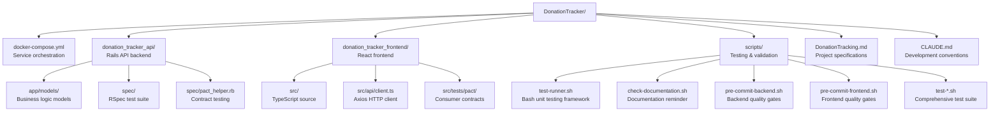

# Claude Development Conventions & Best Practices

*Guidelines for maintaining consistent development practices in the Donation Tracker project*

---

## 🏗️ Project Structure & Repository Strategy

### Monorepo with Service Separation
- **Single repository** containing both backend and frontend
- **Service-separated commits** for clear development history
- **Independent development** workflows per service
- **Atomic feature commits** when features span both services

### Directory Structure



---

## 📊 Documentation & Diagram Standards

### Mermaid Diagram Requirements
- **All diagrams MUST use Mermaid format** for consistency and maintainability
- **No ASCII art or text trees** - convert to proper Mermaid syntax
- **Version controllable** - diagrams stored as code alongside documentation
- **GitHub rendering** - automatically renders in markdown files and PRs

### Supported Diagram Types
- **Flowcharts**: Project structure, workflows, decision trees
- **Sequence Diagrams**: API interactions, authentication flows
- **Git Graphs**: Branch strategies, commit workflows
- **Entity Relationship Diagrams**: Database schema, model relationships
- **User Journey Maps**: Feature workflows, user interactions

### Mermaid Benefits
- **IDE Support**: Syntax highlighting and preview in VS Code
- **Maintainable**: Easy to update as code changes
- **Consistent**: Uniform styling across all documentation
- **Professional**: Clean, standardized visual representation

### Example Usage


---

## 📝 Commit Message Conventions

### Required Prefixes
- `backend:` - Rails API changes, models, controllers, gems
- `frontend:` - React components, TypeScript, styling, client logic
- `docker:` - Container configuration, docker-compose changes
- `docs:` - Documentation updates, README changes
- `feat:` - Cross-cutting features spanning multiple services
- `fix:` - Bug fixes across services
- `chore:` - Maintenance tasks, dependency updates

### Commit Message Format
```
<prefix>: <concise description>

- Detailed explanation of changes
- Why this change was necessary
- Any breaking changes or migration notes

```

### ⚠️ MANDATORY PRE-COMMIT RULE
**ALWAYS update DonationTracking.md and CLAUDE.md before ANY commit**
- Document new features, tools, dependencies, and decisions
- Keep architecture diagrams and usage examples current
- Update version numbers and configuration details
- Reflect changes in completed work sections

### Examples
```bash
backend: add User model with username validation
frontend: create responsive donation form component
docker: fix PostgreSQL connection in test environment
feat: implement end-to-end donation workflow
```

---

## 🧪 Test-Driven Development (TDD) - 2025 Enhanced Methodology

### Strict TDD Workflow (Single Test Rule)
1. **Red**: Write ONLY ONE failing test at a time
   - No multiple tests during red phase
   - Must fail for the right reason
   - Clear, descriptive test name (reads like plain English)
2. **Green**: Write minimal code to make ONLY that test pass
   - No over-engineering
   - Simplest possible implementation
3. **Refactor**: When ALL tests are passing, improve code OR tests
   - **Code Refactoring**: Check for code smells and design pattern opportunities
   - **Test Refactoring**: Improve clarity, remove duplication, better organization
   - **Functionality Preservation**: Must maintain all existing functionality during refactoring
   - **Convention Adherence**: Ensure established patterns are followed
4. **Repeat**: Continue with next single test

#### TDD Workflow Visualization

```mermaid
flowchart LR
    A[🔴 RED<br/>Write ONE failing test] --> B[🟢 GREEN<br/>Minimal code to pass]
    B --> C[🔵 REFACTOR<br/>Improve code/tests]
    C --> D[All tests pass?]
    D -->|Yes| A
    D -->|No| E[🔧 Fix issues]
    E --> C

    style A fill:#ffcccc
    style B fill:#ccffcc
    style C fill:#ccccff
    style E fill:#fff2cc
```



### One Expectation Rule
- Each test should make only ONE assertion
- Helps identify specific failures quickly
- Makes tests more readable and focused
- Example: Test validation separately from business logic

### Bug Prevention Protocol
- **Bug Discovery**: Any bug found MUST have a test written FIRST
- **Test-First Bug Fixes**: Follow full TDD cycle for bug resolution
  1. Write failing test that reproduces the bug
  2. Fix the bug with minimal code
  3. Refactor if needed
- **Regression Prevention**: Test ensures bug cannot resurface in future

### Backend Testing Stack
- **RSpec**: Primary testing framework
- **Factory Bot**: Test data generation
- **Faker**: Realistic test data
- **SimpleCov**: Coverage reporting (minimum 90%)
- **Shoulda Matchers**: Clean model validations
- **Database Cleaner**: Test isolation
- **WebMock + VCR**: HTTP request mocking

### Frontend Testing Stack
- **Jest**: Unit testing framework (v27.5.1, via react-scripts)
- **Vitest**: Modern testing alternative (v1.6.1) with UI dashboard
- **React Testing Library**: Component testing (v16.3.0)
- **Cypress**: End-to-end testing (v13.17.0)
- **MSW**: API mocking for integration tests (v2.0.0)

#### Testing Framework Options
```bash
# Traditional Jest (current default)
npm test

# Modern Vitest (alternative)
npm run vitest
npm run vitest:ui    # Visual dashboard
```

### Contract Testing (Consumer-Driven) - Installed & Configured
- **Pact**: Consumer-driven contract testing between React and Rails API
- **Backend**: Pact gem (v1.66.1) with provider verification setup
- **Frontend**: @pact-foundation/pact (v12.0.0) for consumer contract definition
- **Consumer Tests**: React app defines expected API behavior in tests
- **Provider Verification**: Rails API validates against consumer contracts
- **CI/CD Integration**: Automated contract verification prevents breaking changes

#### Configuration Files Created
```bash
# Backend
donation_tracker_api/spec/pact_helper.rb           # Provider setup
donation_tracker_api/spec/pacts/                   # Contract files

# Frontend
donation_tracker_frontend/src/tests/pact/setup.ts  # Consumer setup
donation_tracker_frontend/src/tests/pact/*.test.ts # Example contracts
```

### Test Requirements
- **All models**: Must have comprehensive validation and relationship tests
- **All API endpoints**: Must have request/response tests
- **Critical user flows**: Must have end-to-end tests
- **Coverage minimum**: 90% for backend, 80% for frontend

### Code Smell Detection & Design Pattern Tracking (2025)

#### Automated Analysis Tools (Installed & Configured)
- **Reek**: Detects code smells in Ruby code (v6.5.0)
- **RubyCritic**: Quality report wrapping Reek, Flay, and Flog (v4.10.0)
- **Skunk**: Calculates cost metric for each file (v0.5.4)
- **Bullet**: N+1 query detection and unused eager loading (v8.0.8)

#### Usage Examples
```bash
# Check code smells
bundle exec reek app/models/user.rb

# Generate quality report
bundle exec rubycritic --no-browser app/models/

# Check cost metrics (requires SimpleCov coverage data)
bundle exec skunk

# Current quality status: RubyCritic score 100.0 ✅
```

#### Design Pattern Registry
Track and enforce these Rails patterns:
- **Service Objects**: Encapsulate complex business logic
- **Query Objects**: Complex database queries
- **Form Objects**: Handle complex form validations
- **Decorator/Presenter**: View-specific logic
- **Value Objects**: Immutable data structures
- **Policy Objects**: Authorization logic
- **Interactors**: Multi-step business processes

#### Refactoring Guidelines
- **SimpleCov + Skunk**: Identify high-complexity, low-coverage areas first
- **Pattern Recognition**: Look for repeated code that could use established patterns
- **Incremental Approach**: Small, safe changes with full test coverage
- **Convention Enforcement**: Ensure new code follows established project patterns

---

## 🐳 Containerization Standards

### Development Environment
```bash
# Start all services
docker-compose up

# Individual service access
docker-compose exec api bash      # Rails console access
docker-compose exec frontend sh   # React debugging
```

### Service Ports
- **PostgreSQL**: 5432
- **Redis**: 6379
- **Rails API**: 3001
- **React Frontend**: 3000

### Container Requirements
- **Rails**: Include build tools for native gems
- **React**: Use Node.js LTS with npm install (not npm ci in dev)
- **Database**: Use PostgreSQL 15-alpine for performance
- **Networking**: All services must communicate via service names

### Troubleshooting Guide
**Native gem compilation errors**: Use Docker with build tools
**Container networking issues**: Check service names in configs
**Database connection failures**: Verify host/port in database.yml
**npm installation failures**: Delete package-lock.json and use `npm install`

---

## 🤝 Contract Testing Implementation (2025)

### Consumer-Driven Contract Testing Workflow

#### Consumer Side (React Frontend)
```javascript
// Example: User API contract test
describe('User API Contract', () => {
  it('should get user by ID', async () => {
    // Define expected contract
    await provider
      .given('user 123 exists')
      .uponReceiving('a request for user 123')
      .withRequest({
        method: 'GET',
        path: '/api/users/123',
        headers: { 'Accept': 'application/json' }
      })
      .willRespondWith({
        status: 200,
        body: { id: 123, username: 'testuser' }
      });

    // Test against mock provider
    const user = await apiClient.getUser(123);
    expect(user.username).toBe('testuser');
  });
});
```

#### Provider Side (Rails API)
```ruby
# spec/pact_helper.rb
RSpec.describe 'User API Provider', type: :pact do
  let(:provider) { Pact::Provider.new }

  before do
    # Set up test data based on provider states
    User.create!(id: 123, username: 'testuser')
  end

  it 'validates user contracts' do
    Pact.verify_provider(
      provider_base_url: 'http://localhost:3001',
      pact_files: ['spec/pacts/frontend-api.json']
    )
  end
end
```

#### Pact Broker Integration
- Store and version contracts centrally
- Enable independent deployments
- Track consumer-provider compatibility
- Automate contract verification in CI/CD

#### Best Practices
- **One Contract Per Consumer-Provider Pair**: Clear ownership and responsibility
- **Provider States**: Use given() clauses to set up test data
- **Semantic Versioning**: Version contracts with breaking change detection
- **Fail Fast**: Contract failures should block deployments

---

## 🎯 Code Quality Standards

### Backend (Rails)
- **RuboCop**: Enforce Ruby style guide
- **Brakeman**: Security vulnerability scanning
- **Bullet**: N+1 query detection
- **No comments**: Let code be self-documenting
- **Convention**: Follow Rails conventions, use existing patterns

### Frontend (React)
- **ESLint**: React, accessibility, and TypeScript rules
- **Prettier**: Consistent code formatting
- **TypeScript**: Strict mode enabled
- **Mobile-first**: All components must be responsive
- **Axios**: Standardized API client with interceptors

### Pre-commit Requirements
Before committing code:
1. **Documentation Update Rule**: ALWAYS update DonationTracking.md and CLAUDE.md to reflect changes
   - Add new features/tools to completed work sections
   - Update development decisions and architecture diagrams
   - Document new dependencies with versions
   - Update usage examples and configuration details
2. All tests must pass (`bundle exec rspec` for backend, `npm test` for frontend)
3. Linting must pass (RuboCop, ESLint)
4. Security checks must pass (Brakeman)
5. Coverage thresholds must be met (90% backend, 80% frontend)
6. Code smell analysis must show no new issues (Reek)
7. Quality metrics must be maintained (RubyCritic score ≥95)
8. Contract tests must pass (Pact verification)
9. Cost metrics should not increase significantly (Skunk)

#### Pre-commit Hooks Flow

```mermaid
flowchart TD
    A[Developer commits code] --> B[Pre-commit hooks triggered]

    B --> C[Documentation Check]
    C --> C1{DonationTracking.md<br/>& CLAUDE.md updated?}
    C1 -->|No| C2[⚠️ Warning: Update docs]
    C1 -->|Yes| D[Backend Validation]

    D --> D1[RuboCop Linting]
    D1 --> D2[Brakeman Security]
    D2 --> D3[RSpec Tests]
    D3 --> D4{All backend<br/>checks pass?}

    D4 -->|No| F1[❌ Commit blocked]
    D4 -->|Yes| E[Frontend Validation]

    E --> E1[ESLint + Accessibility]
    E1 --> E2[Prettier Formatting]
    E2 --> E3[TypeScript Checks]
    E3 --> E4{All frontend<br/>checks pass?}

    E4 -->|No| F1
    E4 -->|Yes| F2[✅ Commit allowed]

    C2 --> D

    style C2 fill:#fff2cc
    style F1 fill:#ffcccc
    style F2 fill:#ccffcc
```



---

## 🚀 2025 Framework Best Practices

### Rails 8.0 Best Practices
- **RSpec Philosophy**: "One expectation per test" for clear failure identification
- **Descriptive Test Names**: Should read like plain English documentation
- **No Nested Scenarios**: Avoid complex setup, prefer focused individual tests
- **Factory Over Fixtures**: Use Factory Bot for maintainable test data
- **Integration Over Controller**: Focus on request specs rather than controller specs
- **Shared Examples**: Group common behavior testing patterns

#### Rails 8 Testing Hierarchy
```ruby
# 1. Model Tests (most important)
RSpec.describe User, type: :model do
  it "requires a username" do
    user = User.new
    expect(user).not_to be_valid
    expect(user.errors[:username]).to include("can't be blank")
  end
end

# 2. Request Tests (API endpoints)
RSpec.describe "/api/users", type: :request do
  it "creates a user with valid attributes" do
    post "/api/users", params: { user: { username: "test" } }
    expect(response).to have_http_status(:created)
  end
end

# 3. Integration Tests (user flows)
# 4. System Tests (full browser testing)
```

### React 19 + TypeScript Best Practices (2025)
- **Testing Framework Choice**: Jest remains standard, Vitest for Vite-based projects
- **Component Testing**: React Testing Library for user-focused testing
- **Async Handling**: Use `waitFor` and `findBy` methods for async operations
- **TypeScript Strict Mode**: Enable strict type checking for better reliability
- **Mobile-First Testing**: Test responsive behavior and touch interactions

#### React Testing Patterns
```typescript
// 1. Component Unit Tests
describe('UserForm', () => {
  it('submits form with valid data', async () => {
    render(<UserForm onSubmit={mockSubmit} />);
    await user.type(screen.getByLabelText(/username/i), 'testuser');
    await user.click(screen.getByRole('button', { name: /submit/i }));
    expect(mockSubmit).toHaveBeenCalledWith({ username: 'testuser' });
  });
});

// 2. Integration Tests with MSW
// 3. E2E Tests with Cypress
```

### Testing Architecture Hierarchy
1. **Unit Tests**: Fast, isolated, high coverage (90%+)
2. **Integration Tests**: Component interactions, API calls (80%+)
3. **Contract Tests**: API compatibility between services
4. **E2E Tests**: Critical user journeys, slow but comprehensive

### Performance Best Practices
- **Bundle Analysis**: Monitor JavaScript bundle sizes
- **Database Query Optimization**: Use Bullet gem to prevent N+1 queries
- **Caching Strategy**: Implement appropriate caching at all layers
- **Image Optimization**: WebP format, lazy loading, responsive images

---

## 🚀 Development Workflow

### Feature Development Process
1. **Plan**: Break feature into TDD-friendly tasks
2. **Backend First**: Create models with TDD approach
3. **API Layer**: Build endpoints with request/response tests
4. **Frontend**: Create components with React Testing Library
5. **Integration**: End-to-end testing with real API calls
6. **Documentation**: Update DonationTracking.md and CLAUDE.md with changes
7. **Review**: Code quality, performance, security

### Branch Strategy
- **main/master**: Production-ready code
- **feature/feature-name**: Development branches
- **Direct commits**: Acceptable for single-developer project
- **Service separation**: Maintain in commits even on single branch

### Environment Variables
- Use `.env` files for local development
- Never commit secrets or API keys
- Document all required environment variables

---

## 📚 Development Environment Setup

### Prerequisites
- Docker & Docker Compose
- Git with proper configuration
- VS Code with Ruby/TypeScript extensions

### Initial Setup
```bash
# Clone and start
git clone <repo-url>
cd DonationTracker
docker-compose up

# Verify services
curl http://localhost:3001     # Rails API health
curl http://localhost:3000     # React frontend
```

### Development Commands
```bash
# Backend
docker-compose exec api rails console
docker-compose exec api bundle exec rspec
docker-compose exec api bundle exec rubocop
docker-compose exec api bundle exec reek app/
docker-compose exec api bundle exec rubycritic --no-browser app/
docker-compose exec api bundle exec skunk

# Frontend
docker-compose exec frontend npm test
docker-compose exec frontend npm run vitest
docker-compose exec frontend npm run vitest:ui
docker-compose exec frontend npm run test:pact
docker-compose exec frontend npm run lint

# Pre-commit Scripts Testing (TDD-driven bash testing)
bash scripts/test-check-documentation.sh      # Test documentation checker (2 tests ✅)
bash scripts/test-pre-commit-backend.sh       # Test backend validator (6 tests ✅)
bash scripts/test-pre-commit-frontend.sh      # Test frontend validator (5 tests ✅)

# Integration Testing (Real Tool Execution)
bash scripts/integration-test-backend.sh      # Test against actual Rails API (4 tests ✅)
bash scripts/integration-test-frontend.sh     # Test against actual React app (5 tests ✅)

# Production Pre-commit Scripts (FULLY FUNCTIONAL)
bash scripts/check-documentation.sh           # ⚠️ Documentation reminder
bash scripts/pre-commit-backend.sh           # 🔍 RuboCop + 🔒 Brakeman + 🧪 RSpec (REAL execution ✅)
bash scripts/pre-commit-frontend.sh          # 🔍 ESLint + 🎨 Prettier + 📝 TypeScript + 🧪 Jest (REAL execution ✅)

# Pre-commit Hooks Installation
pip install pre-commit                        # Install pre-commit framework
pre-commit install                           # Install git hooks
pre-commit run --all-files                  # Run all hooks manually
```

---

## 🎨 UI/UX Guidelines

### Design Principles
- **Mobile-first**: Design for small screens first
- **Accessibility**: WCAG 2.1 AA compliance
- **Performance**: Optimize for slow connections
- **Usability**: Clear navigation and error messaging

### Component Standards
- All components must be responsive
- Use semantic HTML elements
- Include proper ARIA labels
- Test with screen readers

---

## 🔒 Security Requirements

### Backend Security
- Input validation on all endpoints
- SQL injection prevention (parameterized queries)
- XSS protection headers
- Rate limiting on API endpoints
- Audit logging for sensitive operations
- **Never commit master.key or credentials to git**
- Use environment variables for sensitive configuration

### Frontend Security
- Sanitize all user inputs
- Secure API token storage
- HTTPS enforcement
- Content Security Policy headers

### Key Management Best Practices
- **Rails master.key**: Must remain local only, never in version control
- **Environment variables**: Use for deployment-specific secrets
- **Git history**: Regularly audit for accidentally committed secrets
- **Backup strategy**: Keep secure backups of keys separate from code
- **Rotation policy**: Establish key rotation procedures for production

---

## 📊 Monitoring & Debugging

### Logging Standards
- Structured logging (JSON format)
- Log levels: DEBUG, INFO, WARN, ERROR
- No sensitive data in logs
- Request/response logging for APIs

### Performance Monitoring
- Database query monitoring (Bullet gem)
- API response time tracking
- Frontend bundle size monitoring
- Container resource usage

---

## 🔄 Deployment Considerations

### Production Readiness Checklist
- [ ] All tests passing
- [ ] Security audit completed
- [ ] Environment variables configured
- [ ] Database migrations tested
- [ ] SSL certificates configured
- [ ] Backup strategy implemented
- [ ] Monitoring systems active

---

*This document should be updated as development practices evolve*
*Last updated: 2025-09-24*