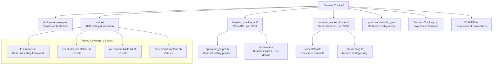

# Children's Home Donation Tracking System - Development Specification

---
## 🚀 DEVELOPMENT STATUS (Updated: 2025-09-24)

### ✅ COMPLETED WORK

**Infrastructure & Environment:**
- [x] Docker Compose setup with PostgreSQL 15, Redis, Rails API, React frontend
- [x] Containerized development environment (all services operational on ports 5432, 6379, 3001, 3000)
- [x] Git repository with service-separated commit strategy (`backend:`, `frontend:`, `docs:`)

**Backend (Rails API):**
- [x] Rails 8.0.2 API with Ruby 3.4.2 (upgraded from original Rails version)
- [x] PostgreSQL 15 database configuration with Docker networking
- [x] Comprehensive testing stack: RSpec, Factory Bot, Faker, SimpleCov, Shoulda Matchers, Database Cleaner, WebMock, VCR
- [x] Code quality tools: RuboCop, Brakeman, Bullet (N+1 query detection)
- [x] Advanced analysis tools: Reek (code smells), RubyCritic (quality reports), Skunk (cost metrics)
- [x] Contract testing: Pact gem for consumer-driven API contracts
- [x] User model with TDD workflow demonstration (username validation - simplified from email-based auth)
- [x] Database migrations and schema setup

**Frontend (React):**
- [x] React 19.1.1 with TypeScript (upgraded to latest React)
- [x] Mobile-first testing framework: Jest, React Testing Library, Cypress, MSW
- [x] Modern testing alternatives: Vitest with UI for enhanced DX
- [x] Contract testing: Pact Foundation for consumer contract definition
- [x] Code quality tools: ESLint with React and accessibility plugins, Prettier
- [x] Axios HTTP client with authentication interceptors
- [x] Responsive foundation for mobile-first design

**Quality Assurance & Pre-commit System:**
- [x] TDD-driven pre-commit hooks system with comprehensive bash testing framework (13 passing tests)
- [x] Documentation update enforcement before all commits (check-documentation.sh)
- [x] Backend quality gates: RuboCop, Brakeman, RSpec validation (pre-commit-backend.sh)
- [x] Frontend quality gates: ESLint, Prettier, TypeScript validation (pre-commit-frontend.sh)
- [x] Bash unit testing framework with assert functions and comprehensive coverage (test-runner.sh)
- [x] **PRODUCTION-READY**: Real tool execution replacing mock implementations
- [x] **INTEGRATION TESTED**: All scripts validated against actual Rails/React codebase
- [x] **FULLY FUNCTIONAL**: Backend (3 tools) and Frontend (4 tools) quality enforcement working
- [x] **CODE QUALITY METRICS**: 0 RuboCop violations, 0 Brakeman security warnings, all tests passing
- [x] **TYPE SAFETY**: TypeScript errors resolved, Pact v12 API correctly implemented

**Development Decisions Made:**
- **Authentication Strategy**: Started with username-only User model (not email-based initially) for TDD demonstration
- **Repository Strategy**: Monorepo with service-separated commits for atomic feature development
- **Containerization**: Solves native gem compilation issues and ensures consistent environment
- **Testing Philosophy**: TDD methodology with strict single-test rule and comprehensive coverage requirements
- **Quality Assurance**: Multiple analysis tools (Reek, RubyCritic, Skunk) for maintaining high code standards
- **Contract Testing**: Pact implementation for reliable API contract verification between services
- **Security**: Git history cleaned of sensitive files (master.key) using filter-branch, comprehensive .gitignore implemented

**Current Architecture:**



**Next Development Phase**:
1. **Integration Testing**: Replace mock implementations with real tool execution (RuboCop, Brakeman, ESLint, etc.)
2. **CI/CD Pipeline**: Implement automated quality gates and deployment workflows
3. **Feature Development**: Expand User model → Create Donor model → Implement authentication system

---

## Project Overview
A secure web application to track donations for a children's home and school organization. The system manages general donations, project-specific donations, and a child sponsorship program with recurring payment tracking and automated missed payment detection.

## Tech Stack
- **Frontend:** React
- **Backend:** Rails API
- **Database:** PostgreSQL
- **Authentication:** Google OAuth (via Devise + omniauth-google-oauth2)
- **Payment Processing:** Stripe integration with webhooks
- **Hosting:** Digital Ocean with HTTPS
- **Development:** TDD approach, Git version control

## Core Data Models

### Users
- **Fields:** id, email, name, role, google_id, created_at, updated_at
- **Roles:** super_admin, admin, read_only
- **Authentication:** Google OAuth only

### Donors
- **Fields:** id, name, email, phone, address, notes, created_at, updated_at
- **Relationships:** has_many donations, has_many sponsorships

### Children
- **Fields:** id, name, age, bio, photo_url, active, created_at, updated_at
- **Relationships:** has_many sponsorships

### Projects
- **Fields:** id, name, description, funding_goal, current_amount, active, created_at, updated_at
- **Relationships:** has_many donations

### Donations
- **Fields:**
  - id, donor_id, project_id (nullable)
  - amount (decimal), date, donation_type, payment_method
  - stripe_payment_intent_id (nullable), notes
  - recurring (boolean), frequency (enum: monthly/quarterly/annually)
  - last_received_date, expected_next_date
  - missed_payments_count (integer, default: 0)
  - status (enum: active/late/overdue/at_risk/cancelled/paused)
  - created_at, updated_at
- **Donation Types:** general, project, sponsorship
- **Payment Methods:** stripe, check, cash, other
- **Relationships:** belongs_to donor, belongs_to project (optional)

### Sponsorships
- **Fields:** id, donor_id, child_id, monthly_amount, start_date, end_date, active, created_at, updated_at
- **Relationships:** belongs_to donor, belongs_to child
- **Note:** Many-to-many relationship (one donor can sponsor multiple children, one child can have multiple sponsors)

## Key Features by Development Phase

### Phase 1 - Prototype (2-3 weeks)
**Authentication & Basic CRUD:**
- Google OAuth integration with role-based access
- Donor management (create, read, update, delete)
- Basic donation entry (manual only)
- Children management
- Simple list views with basic search

**Essential Security:**
- HTTPS setup
- Input validation
- Basic logging
- CORS configuration

### Phase 2 - MVP (4-6 weeks)
**Recurring Donations & Automation:**
- Automated expected_next_date calculation
- Daily background job for missed payment detection
- Status updates (active → late → overdue → at_risk → cancelled)
- Admin dashboard with overdue donation alerts

**Stripe Integration:**
- Webhook endpoint for successful payments
- Automatic donation record updates
- Customer matching via metadata or email

**Enhanced Features:**
- Project-based donations
- Sponsorship assignment interface (manual matching)
- Advanced search and filtering (using Ransack gem)
- CSV import for historical Google Sheets data

**Reporting:**
- Monthly donation totals
- Annual donation reports
- Individual donor giving history
- Sponsorship status reports

### Phase 3 - Advanced Features
**Enhanced Reporting & Analytics:**
- Donor retention metrics
- Revenue forecasting based on recurring donations
- Sponsorship stability analytics
- Custom date range reports

**User Experience:**
- Dashboard widgets
- Bulk actions for donation management
- Email notifications for overdue payments
- Export functionality (CSV, PDF)

## Technical Implementation Details

### Rails API Setup
**Required Gems:**
```ruby
gem 'devise'
gem 'omniauth-google-oauth2'
gem 'omniauth-rails_csrf_protection'
gem 'stripe'
gem 'ransack'          # Search/filtering
gem 'kaminari'         # Pagination
gem 'sidekiq'          # Background jobs
gem 'rspec-rails'      # Testing
gem 'factory_bot_rails'
gem 'faker'
```

### Automated Expected Date Logic
- Trigger: After donation creation/update where recurring = true
- Calculate next expected date based on frequency
- Reset missed_payments_count on successful payment
- Update status appropriately

### Background Job Schedule
**Daily Job:** CheckMissedPaymentsJob
- Find donations where expected_next_date < today
- Update status based on days overdue:
  - 1-7 days: 'late'
  - 8-30 days: 'overdue' (increment missed_payments_count)
  - 31-90 days: 'at_risk'
  - 90+ days: 'cancelled'
- Send admin notifications for overdue/at_risk donations

### Stripe Webhook Handling
**Endpoint:** POST /webhooks/stripe
**Events to handle:**
- `payment_intent.succeeded`
- `invoice.payment_succeeded` (for subscriptions)
- `customer.subscription.deleted`

**Webhook Logic:**
1. Verify webhook signature
2. Find matching donation by customer_id or metadata
3. Update last_received_date to payment date
4. Automatically calculate new expected_next_date
5. Reset missed_payments_count and status

### Security Requirements
- All routes require authentication except webhook endpoint
- Role-based authorization (CanCan or Pundit)
- Input sanitization and validation
- SQL injection prevention (use parameterized queries)
- XSS protection
- Rate limiting on API endpoints
- Database encryption at rest
- Audit logging for sensitive operations

### Database Considerations
**Indexes needed:**
- donors(email)
- donations(donor_id, date)
- donations(expected_next_date) for missed payment queries
- donations(stripe_payment_intent_id)
- sponsorships(donor_id, child_id)

**Constraints:**
- Sponsorship monthly_amount should be positive
- Donation amount should be positive
- Expected_next_date should be future date for active recurring donations

## API Endpoints Structure

### Authentication
- POST /auth/google_oauth2 (OAuth callback)
- DELETE /auth/logout

### Donors
- GET /api/donors (with search/pagination)
- POST /api/donors
- GET /api/donors/:id
- PUT /api/donors/:id
- DELETE /api/donors/:id

### Donations
- GET /api/donations (with filtering)
- POST /api/donations
- GET /api/donations/:id
- PUT /api/donations/:id
- DELETE /api/donations/:id
- GET /api/donations/overdue (admin dashboard)

### Children
- GET /api/children
- POST /api/children (admin only)
- PUT /api/children/:id (admin only)

### Sponsorships
- GET /api/sponsorships
- POST /api/sponsorships (admin only)
- PUT /api/sponsorships/:id (admin only)
- DELETE /api/sponsorships/:id (admin only)

### Reports
- GET /api/reports/monthly/:year/:month
- GET /api/reports/annual/:year
- GET /api/reports/donor/:id

### Webhooks
- POST /webhooks/stripe

## Testing Strategy
- Unit tests for all models with business logic
- Controller tests for API endpoints
- Integration tests for authentication flow
- Webhook testing with Stripe test events
- Background job testing
- Feature tests for critical user flows

## Deployment Requirements
- Digital Ocean droplet with Ubuntu
- PostgreSQL database
- Redis for background job queue
- SSL certificate (Let's Encrypt)
- Environment variables for secrets
- Automated database backups
- Log rotation and monitoring
- Git deployment workflow

## Data Import Plan
- CSV import rake task for historical Google Sheets data
- Mapping: detect recurring donations from historical patterns
- Donor deduplication logic
- Validation and error reporting during import

## Future Considerations
- Email notifications to donors
- Donor portal for self-service
- Mobile app for field staff
- Integration with accounting software
- Advanced analytics and forecasting