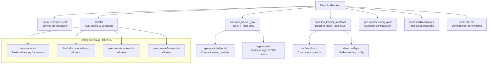

# Children's Home Donation Tracking System - Development Specification

---
## 🚀 DEVELOPMENT STATUS (Updated: 2025-10-15)

### ✅ COMPLETED WORK

**Infrastructure & Environment:**
- [x] Docker Compose setup with PostgreSQL 15, Redis, Rails API, React frontend
- [x] Containerized development environment (all services operational on ports 5432, 6379, 3001, 3000)
- [x] Isolated test environment: api-e2e service (port 3002) with separate test database for Cypress E2E tests
- [x] CORS configuration via environment variables (CORS_ALLOWED_ORIGINS) for flexible deployment
- [x] Git repository with service-separated commit strategy (`backend:`, `frontend:`, `docs:`)

**Backend (Rails API):**
- [x] Rails 8.0.2 API with Ruby 3.4.2 (upgraded from original Rails version)
- [x] PostgreSQL 15 database configuration with Docker networking
- [x] Comprehensive testing stack: RSpec, Factory Bot, Faker, SimpleCov, Shoulda Matchers, Database Cleaner, WebMock, VCR
- [x] **FactoryBot Best Practices**: Default factory values with Faker for realistic test data (names, emails), DRY test code
- [x] Code quality tools: RuboCop, Brakeman, Bullet (N+1 query detection)
- [x] Advanced analysis tools: Reek (code smells), RubyCritic (quality reports), Skunk (cost metrics)
- [x] Contract testing: Pact gem for consumer-driven API contracts
- [x] User model with TDD workflow demonstration (username validation - simplified from email-based auth)
- [x] Database migrations and schema setup
- [x] **Donor Model**: Email uniqueness validation, PaperTrail audit tracking, smart defaults, soft delete with Discard gem
- [x] **DonorService**: Smart data merging with date-based conflict resolution (preserves existing name when blank)
- [x] **Donor API Endpoints**:
  - POST /api/donors (returns 201 Created or 200 OK)
  - GET /api/donors (ordered alphabetically by name, excludes discarded, pagination with metadata)
  - GET /api/donors?include_discarded=true (includes archived donors)
  - GET /api/donors/:id
  - PATCH /api/donors/:id
  - DELETE /api/donors/:id (soft delete/archive)
  - POST /api/donors/:id/restore (restore archived donor)
  - POST /api/donors/merge (merge multiple donors with field selection)
  - DELETE /api/donors/all (hard delete for test cleanup)
- [x] **DonorMergeService**: Transaction-safe donor merging with field-level selection, merged_into_id tracking, automatic soft delete of source donors
- [x] **Merged Donor Filtering**: Donors with merged_into_id excluded from both active and archived lists (prevents duplicate display)
- [x] **Search & Pagination**: Ransack gem with custom name_or_email searcher, Kaminari pagination (25 per page default)
- [x] **Soft Delete**: Discard gem for archiving donors with discarded_at timestamp
- [x] **Status Code Differentiation**: 201 for new donor creation, 200 for existing donor updates
- [x] **CSV Import**: DonorImportService for bulk donor import via CLI with error handling and summary reporting
- [x] **Rake Task**: `donors:import[file.csv]` for importing donors from Stripe CSV exports
- [x] **Stripe Format Support**: Auto-detects "Billing Details Name" and "Cust Email" headers
- [x] **Case-Insensitive Lookups**: Email matching ignores capitalization for duplicate detection

**Frontend (React):**
- [x] React 19.1.1 with TypeScript (upgraded to latest React)
- [x] Mobile-first testing framework: Jest, React Testing Library, Cypress, MSW
- [x] Modern testing alternatives: Vitest with UI for enhanced DX
- [x] Contract testing: Pact Foundation for consumer contract definition
- [x] Code quality tools: ESLint with React and accessibility plugins, Prettier
- [x] Axios HTTP client with authentication interceptors
- [x] Responsive foundation for mobile-first design
- [x] **Material-UI (MUI) v6**: Mobile-first component library with Stack, Card, Typography, Button, TextField, Alert
- [x] **DonorForm Component**: Create/update donors with styled button (variant="contained"), fullWidth fields, Stack spacing
- [x] **Smart UI Feedback**: "Donor created successfully!" (201) vs "Donor updated successfully!" (200)
- [x] **Form Auto-clear**: Name and email fields clear after successful submission
- [x] **DonorList Component**: Card-based layout with outlined variant, Typography variants (subtitle1 for names, body2 for emails), multi-select checkboxes for donor merging
- [x] **Donor Merge UI**: "Merge Selected" button (appears when ≥2 donors selected), DonorMergeModal with side-by-side comparison and radio button field selection
- [x] **Archive/Restore UI**: Visual indicators (opacity 0.6, Archive chip), Archive/Restore buttons with tooltips for accessibility
- [x] **Archived Donors Toggle**: Show/hide archived donors with toggle button, search respects archived state
- [x] **App Integration**: Fetches donors on mount, automatically refreshes list after form submission
- [x] **Search UI**: Debounced search (300ms) for name OR email with placeholder "Search by name or email..."
- [x] **Pagination UI**: Material-UI Pagination component with server-side pagination (10 per page)
- [x] **Hot Reload Configuration**: WATCHPACK_POLLING=300ms for automatic code changes without manual cache clearing
- [x] **Cypress E2E Testing**: Test database isolation via cy.intercept() redirecting to port 3002, comprehensive search and archive validation, donor merge workflow test (7 passing tests)
- [x] **Config-Driven URLs**: REACT_APP_API_URL for dev, devApiUrl/testApiUrl for Cypress (no hardcoded ports)
- [x] **Donation Model**: Created with validations (amount > 0, date not in future), belongs_to :donor association, `ransackable_attributes` for Ransack filtering
- [x] **Donation API Endpoints**: POST /api/donations (create), GET /api/donations/:id (show), GET /api/donations (index with pagination/filtering)
- [x] **Donation List & Pagination**: Kaminari pagination (25/page), Material-UI Pagination component, response format `{donations: [...], meta: {...}}`
- [x] **Donation Filtering**: Ransack filtering by donor_id (`donor_id_eq`) and date range (`date_gteq`, `date_lteq`), sort by date descending
- [x] **DonationForm Component**: Amount, date, donor dropdown selection with success messages
- [x] **DonationList Component**: Display donations with pagination controls, shows amount/date/donor name
- [x] **Donation Testing**: 4 model tests, 7 request tests (pagination/filtering), 5 DonationForm tests, 4 DonationList tests, Cypress E2E test (donation creation flow)
- [x] **Factory Bot Integration**: All tests use Factory Bot with Faker for maintainable test data generation
- [x] **Jest Act() Warning Fix**: Added waitFor() pattern for async useEffect initial renders

**Quality Assurance & Pre-commit System:**
- [x] TDD-driven pre-commit hooks system with comprehensive bash testing framework (13 passing tests)
- [x] Documentation update enforcement before all commits (check-documentation.sh)
- [x] Backend quality gates: RuboCop, Brakeman, RSpec validation (pre-commit-backend.sh)
- [x] Frontend quality gates: ESLint, Prettier, TypeScript validation (pre-commit-frontend.sh)
- [x] Bash unit testing framework with assert functions and comprehensive coverage (test-runner.sh)
- [x] **PRODUCTION-READY**: Real tool execution replacing mock implementations
- [x] **INTEGRATION TESTED**: All scripts validated against actual Rails/React codebase
- [x] **FULLY FUNCTIONAL**: Backend (3 tools) and Frontend (4 tools) quality enforcement working
- [x] **CODE QUALITY METRICS**: 0 RuboCop violations, 0 Brakeman security warnings, all tests passing
- [x] **TYPE SAFETY**: TypeScript errors resolved, Pact v12 API correctly implemented
- [x] **TEST COVERAGE**: Backend 64 RSpec tests (4 Donation model + 7 donation requests + 6 DonorMergeService + 1 merge request spec + more), Frontend 50 Jest tests (4 DonationList + 5 DonationForm + 5 App + more), Cypress E2E tests (114 total tests passing)
- [x] **DATABASE CLEANUP**: before(:suite) hook prevents test pollution between runs

**Development Decisions Made:**
- **Authentication Strategy**: Started with username-only User model (not email-based initially) for TDD demonstration
- **Repository Strategy**: Monorepo with service-separated commits for atomic feature development
- **Containerization**: Solves native gem compilation issues and ensures consistent environment
- **Testing Philosophy**: TDD methodology with strict single-test rule and comprehensive coverage requirements
- **FactoryBot Conventions**: Use default factory values (Faker-generated names/emails) for DRY, maintainable tests; explicit values only when testing specific edge cases
- **Test Database Isolation**: Separate api-e2e service with isolated test database prevents dev DB pollution during Cypress tests
- **Config-Driven Development**: Environment variables for all URLs/ports (no hardcoded values) for CI/CD pipeline readiness
- **Quality Assurance**: Multiple analysis tools (Reek, RubyCritic, Skunk) for maintaining high code standards
- **Contract Testing**: Pact implementation deferred until microservice split (monorepo uses RSpec + Cypress integration tests)
- **Security**: Git history cleaned of sensitive files (master.key) using filter-branch, comprehensive .gitignore implemented
- **Service Object Patterns**: Established conventions for class vs instance methods based on complexity (class methods for simple/stateless, instance methods for complex/stateful with private helper extraction)

**Current Architecture:**



**Next Development Phase (Vertical Slice Approach)**:
1. **Slice 1 - Basic Donor Management**: Donor model with validations → API endpoint → React component
2. **Slice 2 - Simple Donation Entry**: Donation model → API endpoint → Form with donor selection
3. **Slice 3 - Donor Dashboard**: List view → Search/filter → Basic reporting
4. **Slice 4 - Authentication**: Google OAuth → Role-based access → Protected routes

---

## Project Overview
A secure web application to track donations for a children's home and school organization. The system manages general donations, project-specific donations, and a child sponsorship program with recurring payment tracking and automated missed payment detection.

## Tech Stack
- **Frontend:** React
- **Backend:** Rails API
- **Database:** PostgreSQL
- **Authentication:** Google OAuth (via Devise + omniauth-google-oauth2)
- **Payment Processing:** Stripe integration with webhooks
- **Hosting:** Digital Ocean with HTTPS
- **Development:** TDD approach, Git version control

## Core Data Models

### Users
- **Fields:** id, email, name, role, google_id, created_at, updated_at
- **Roles:** super_admin, admin, read_only
- **Authentication:** Google OAuth only

### Donors
- **Fields:** id, name, email, phone, address, notes, created_at, updated_at
- **Relationships:** has_many donations, has_many sponsorships

### Children
- **Fields:** id, name, age, bio, photo_url, active, created_at, updated_at
- **Relationships:** has_many sponsorships

### Projects
- **Fields:** id, name, description, funding_goal, current_amount, active, created_at, updated_at
- **Relationships:** has_many donations

### Donations
- **Fields:**
  - id, donor_id, project_id (nullable)
  - amount (decimal), date, donation_type, payment_method
  - stripe_payment_intent_id (nullable), notes
  - recurring (boolean), frequency (enum: monthly/quarterly/annually)
  - last_received_date, expected_next_date
  - missed_payments_count (integer, default: 0)
  - status (enum: active/late/overdue/at_risk/cancelled/paused)
  - created_at, updated_at
- **Donation Types:** general, project, sponsorship
- **Payment Methods:** stripe, check, cash, other
- **Relationships:** belongs_to donor, belongs_to project (optional)

### Sponsorships
- **Fields:** id, donor_id, child_id, monthly_amount, start_date, end_date, active, created_at, updated_at
- **Relationships:** belongs_to donor, belongs_to child
- **Note:** Many-to-many relationship (one donor can sponsor multiple children, one child can have multiple sponsors)

## Development Approach: Thin Vertical Slices

### Core Philosophy
**Build complete features one at a time** through all layers (model → API → frontend → tests) rather than building horizontally (all models, then all APIs, then all frontend). Each slice delivers immediate business value and enables faster feedback.

### Vertical Slice Roadmap

#### Slice 1: Basic Donor Management (1-2 weeks)
**Goal**: Create, view, and manage individual donors
- **Model**: Donor with name/email validation and basic fields
- **API**: `POST /api/donors`, `GET /api/donors/:id`
- **Frontend**: DonorForm and DonorProfile components
- **Tests**: Model validations, API endpoints, component behavior
- **Value**: Can record and view donor information

#### Slice 2: Simple Donation Entry (1-2 weeks)
**Goal**: Record donations for existing donors
- **Model**: Donation with amount validation, belongs_to donor
- **API**: `POST /api/donations`, donor association handling
- **Frontend**: DonationForm with donor selection dropdown
- **Tests**: Model relationships, API data flow, form submission
- **Value**: Can track donation amounts and link to donors

#### Slice 3: Donor Dashboard & Search (1-2 weeks)
**Goal**: Browse and search existing donors and donations
- **API**: `GET /api/donors` with search/pagination
- **Frontend**: DonorList component with search and filtering
- **Tests**: Search functionality, pagination, list rendering
- **Value**: Can find and manage existing donor records

#### Slice 4: Basic Authentication (1-2 weeks)
**Goal**: Secure the application with user access control
- **Model**: Enhanced User model with Google OAuth fields
- **API**: Authentication middleware, protected endpoints
- **Frontend**: Login flow, protected routes, auth context
- **Tests**: Authentication flows, access control
- **Value**: Secure access to donation data

#### Slice 5: Project-Based Donations (1-2 weeks)
**Goal**: Track donations for specific projects/campaigns
- **Model**: Project model, enhanced Donation with project association
- **API**: Project CRUD, donation-project linking
- **Frontend**: Project management, project selection in donation forms
- **Value**: Organize donations by specific campaigns

#### Slice 6: Children & Sponsorship Basics (2-3 weeks)
**Goal**: Manage children and basic sponsorship tracking
- **Models**: Child, Sponsorship (many-to-many donor-child)
- **API**: Children management, sponsorship assignment
- **Frontend**: Child profiles, sponsorship management interface
- **Value**: Track child sponsorship relationships

#### Future Slices (MVP+):
- **Recurring Donation Logic**: Automated payment tracking
- **Stripe Integration**: Payment processing webhooks
- **Reporting Dashboard**: Analytics and summaries
- **Advanced Features**: Bulk operations, export, notifications

### Slice Selection Criteria
**Prioritize slices that:**
- Deliver immediate business value
- Have minimal external dependencies
- Can be completed in 1-2 weeks
- Build incrementally on previous slices
- Enable validation of core assumptions

**Benefits of Vertical Slice Approach:**
- **Faster Feedback**: Working features available immediately
- **Risk Reduction**: Integration issues discovered early
- **User Value**: Stakeholders see progress with each slice
- **Easier Planning**: Clear completion criteria and dependencies

## Technical Implementation Details

### Rails API Setup
**Required Gems:**
```ruby
gem 'devise'
gem 'omniauth-google-oauth2'
gem 'omniauth-rails_csrf_protection'
gem 'stripe'
gem 'ransack'          # Search/filtering
gem 'kaminari'         # Pagination
gem 'sidekiq'          # Background jobs
gem 'rspec-rails'      # Testing
gem 'factory_bot_rails'
gem 'faker'
```

### Automated Expected Date Logic
- Trigger: After donation creation/update where recurring = true
- Calculate next expected date based on frequency
- Reset missed_payments_count on successful payment
- Update status appropriately

### Background Job Schedule
**Daily Job:** CheckMissedPaymentsJob
- Find donations where expected_next_date < today
- Update status based on days overdue:
  - 1-7 days: 'late'
  - 8-30 days: 'overdue' (increment missed_payments_count)
  - 31-90 days: 'at_risk'
  - 90+ days: 'cancelled'
- Send admin notifications for overdue/at_risk donations

### Stripe Webhook Handling
**Endpoint:** POST /webhooks/stripe
**Events to handle:**
- `payment_intent.succeeded`
- `invoice.payment_succeeded` (for subscriptions)
- `customer.subscription.deleted`

**Webhook Logic:**
1. Verify webhook signature
2. Find matching donation by customer_id or metadata
3. Update last_received_date to payment date
4. Automatically calculate new expected_next_date
5. Reset missed_payments_count and status

### Security Requirements
- All routes require authentication except webhook endpoint
- Role-based authorization (CanCan or Pundit)
- Input sanitization and validation
- SQL injection prevention (use parameterized queries)
- XSS protection
- Rate limiting on API endpoints
- Database encryption at rest
- Audit logging for sensitive operations

### Database Considerations
**Indexes needed:**
- donors(email)
- donations(donor_id, date)
- donations(expected_next_date) for missed payment queries
- donations(stripe_payment_intent_id)
- sponsorships(donor_id, child_id)

**Constraints:**
- Sponsorship monthly_amount should be positive
- Donation amount should be positive
- Expected_next_date should be future date for active recurring donations

## API Endpoints Structure

### Authentication
- POST /auth/google_oauth2 (OAuth callback)
- DELETE /auth/logout

### Donors
- GET /api/donors (with search/pagination)
- POST /api/donors
- GET /api/donors/:id
- PUT /api/donors/:id
- DELETE /api/donors/:id

### Donations
- GET /api/donations (with filtering)
- POST /api/donations
- GET /api/donations/:id
- PUT /api/donations/:id
- DELETE /api/donations/:id
- GET /api/donations/overdue (admin dashboard)

### Children
- GET /api/children
- POST /api/children (admin only)
- PUT /api/children/:id (admin only)

### Sponsorships
- GET /api/sponsorships
- POST /api/sponsorships (admin only)
- PUT /api/sponsorships/:id (admin only)
- DELETE /api/sponsorships/:id (admin only)

### Reports
- GET /api/reports/monthly/:year/:month
- GET /api/reports/annual/:year
- GET /api/reports/donor/:id

### Webhooks
- POST /webhooks/stripe

## Testing Strategy
- Unit tests for all models with business logic
- Controller tests for API endpoints
- Integration tests for authentication flow
- Webhook testing with Stripe test events
- Background job testing
- Feature tests for critical user flows

## Deployment Requirements
- Digital Ocean droplet with Ubuntu
- PostgreSQL database
- Redis for background job queue
- SSL certificate (Let's Encrypt)
- Environment variables for secrets
- Automated database backups
- Log rotation and monitoring
- Git deployment workflow

## Data Import Plan
- CSV import rake task for historical Google Sheets data
- Mapping: detect recurring donations from historical patterns
- Donor deduplication logic
- Validation and error reporting during import

## Recent Refactoring & Code Quality Improvements

### TICKET-014: DonorMergeService Refactoring (2025-10-15)
**Objective**: Reduce code complexity and establish consistent service object patterns

**Changes:**
- Refactored `DonorMergeService` from class method to instance pattern
- Extracted single 21-statement method (42.48 flog) into 9 focused private methods
- **Complexity reduced**: 42.48 flog → **4.6 flog/method average**
- Added comprehensive class documentation with usage examples
- Eliminated unclear variable names (`d` → `donor`)

**Files Modified:**
- `app/services/donor_merge_service.rb` - Instance pattern with private helpers
- `app/controllers/api/donors_controller.rb` - Updated to `.new(...).merge` syntax
- `spec/services/donor_merge_service_spec.rb` - Updated test syntax
- `spec/requests/donors_spec.rb` - Updated request spec syntax
- `CLAUDE.md` - Added service pattern conventions section

**Results:**
- ✅ All 52 RSpec tests passing
- ✅ Pattern consistency: Complex services use instance pattern
- ✅ Maintainability: Private method extraction for clarity
- ✅ Documentation: Clear usage examples and inline comments

## Future Considerations
- Email notifications to donors
- Donor portal for self-service
- Mobile app for field staff
- Integration with accounting software
- Advanced analytics and forecasting
