# Architecture & Workflow Diagrams

*Visual representations of project structure, workflows, and development processes*

---

## Project Structure

### Directory Structure

---

## Ticket & Task Management Workflow

**Key Points:**
- **Context Persistence:** Tickets survive `/compact` (external files)
- **Clean Context:** Compact after logging backlog items to remove distractions
- **Async Feature Capture:** Don't lose ideas while focused on current work
- **Historical Record:** Track what was built and why
- **Claude Code Integration:** Use `/memory` to access ticket context

---

## TDD Workflow

```mermaid
flowchart LR
    A[🔴 RED<br/>Write ONE failing test] --> B[🟢 GREEN<br/>Minimal code to pass]
    B --> C[🔵 REFACTOR<br/>Improve code/tests]
    C --> D[All tests pass?]
    D -->|Yes| A
    D -->|No| E[🔧 Fix issues]
    E --> C

    style A fill:#ffcccc
    style B fill:#ccffcc
    style C fill:#ccccff
    style E fill:#fff2cc
```

**Strict TDD Rules:**
1. Write ONLY ONE test at a time
2. Test must fail for the right reason
3. Write minimal code to pass the test
4. Refactor only when all tests are passing
5. Repeat cycle for next test

---

## Vertical Slice Development

```mermaid
flowchart TD
    A[🎯 Choose Next Feature Slice] --> B[🔴 TDD: Model Tests]
    B --> C[🟢 Implement Model]
    C --> D[🔴 TDD: API Tests]
    D --> E[🟢 Implement API Endpoint]
    E --> F[🔴 TDD: Frontend Tests]
    F --> G[🟢 Implement React Component]
    G --> H[🔵 Integration Testing]
    H --> I[📋 Update Documentation]
    I --> J[✅ Feature Complete]
    J --> K[Deploy/Demo Feature]
    K --> A

    style A fill:#e1f5fe
    style B fill:#ffebee
    style C fill:#e8f5e8
    style D fill:#ffebee
    style E fill:#e8f5e8
    style F fill:#ffebee
    style G fill:#e8f5e8
    style H fill:#e3f2fd
    style I fill:#fff3e0
    style J fill:#e8f5e8
    style K fill:#f3e5f5
```

**Core Principle:** Build complete features one at a time through all layers rather than building all models, then all APIs, then all frontend components.

**Each Slice Includes:**
1. Model with validations and relationships
2. API endpoint with request/response handling
3. React component with forms/displays
4. Unit and integration tests at each layer
5. Documentation updates

**Benefits:**
- Faster feedback
- Risk reduction
- Immediate user value
- Easier debugging
- Clear completion criteria

---

## Pre-commit Hooks Flow

```mermaid
flowchart TD
    A[Developer commits code] --> B[Pre-commit hooks triggered]

    B --> C[Documentation Check]
    C --> C1{DonationTracking.md<br/>& CLAUDE.md updated?}
    C1 -->|No| C2[⚠️ Warning: Update docs]
    C1 -->|Yes| D[Backend Validation]

    D --> D1[RuboCop Linting]
    D1 --> D2[Brakeman Security]
    D2 --> D3[RSpec Tests]
    D3 --> D4{All backend<br/>checks pass?}

    D4 -->|No| F1[❌ Commit blocked]
    D4 -->|Yes| E[Frontend Validation]

    E --> E1[ESLint + Accessibility]
    E1 --> E2[Prettier Formatting]
    E2 --> E3[TypeScript Checks]
    E3 --> E4{All frontend<br/>checks pass?}

    E4 -->|No| F1
    E4 -->|Yes| F2[✅ Commit allowed]

    C2 --> D

    style C2 fill:#fff2cc
    style F1 fill:#ffcccc
    style F2 fill:#ccffcc
```

**Quality Gates:**
- Documentation updates (warning)
- RuboCop linting (blocking)
- Brakeman security scan (blocking)
- RSpec tests (blocking)
- ESLint + accessibility (blocking)
- Prettier formatting (blocking)
- TypeScript type checks (blocking)

---

## Service Architecture

### Containerized Development Environment

**Service Ports:**
- PostgreSQL: 5432
- Redis: 6379
- Rails API: 3001
- React Frontend: 3000

**Container Requirements:**
- Rails: Include build tools for native gems
- React: Use Node.js LTS with npm install
- Database: PostgreSQL 15-alpine
- Networking: All services communicate via service names

---

## Testing Strategy

### Testing Pyramid

**Coverage Targets:**
- **Unit Tests**: 90%+ (backend), 80%+ (frontend)
- **Integration Tests**: All API endpoints, component interactions
- **E2E Tests**: 100% of critical user flows

**Testing Philosophy:**
- Most tests at unit level (fast feedback)
- Integration tests for API contracts
- E2E tests for critical user journeys
- Run unit tests continuously
- Run E2E tests before commits

---

## Frontend Architecture

### Multi-Page Router Structure

**Architecture Principles:**
- Each page manages its own state (useState, useEffect)
- No Context API until state sharing needed
- Clean URL-based routing
- Browser back/forward navigation support
- Lazy loading capability for future performance

---

## Data Flow

### API Request Flow

**Key Components:**
- **Axios Client**: Centralized HTTP client with interceptors
- **Controllers**: Thin layer, delegate to services
- **Presenters**: Format JSON responses
- **ActiveRecord**: ORM for database access
- **React State**: Component-level state management

---

## Deployment Architecture (Future)

**Production Considerations:**
- Horizontal scaling for API and frontend
- Database replication for read scalability
- Redis for caching and session storage
- CDN for static assets
- SSL/TLS encryption
- Automated backups

---

*Last updated: 2025-10-21*
