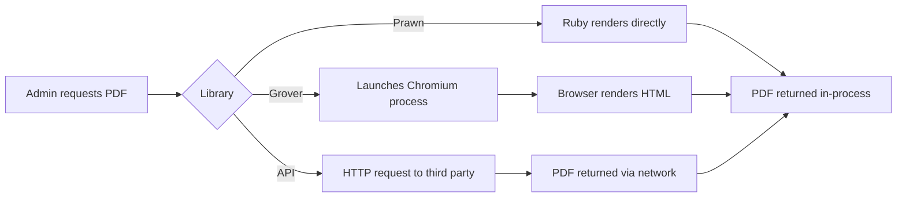

# ADR – PDF Generation Library for Donation Reports and Giving Statements

> Choose the PDF generation approach for donation reports (BL-45) and individual donor giving statements (BL-48).

---

## Status

`proposed` — Michael to decide.

## Created

2026-06-24

## Suggested decision date

2026-07-07 — Reports are not on the critical path today, but this decision gates TICKET-103, TICKET-104, TICKET-105, and TICKET-133. Two weeks gives enough time to confirm before those tickets are scoped and estimated.

---

## Context

Stage 1 confirmed three report types (monthly, quarterly, annual) plus individual donor giving statements, all in PDF format. The system needs to generate PDFs server-side in a Rails 8 + Docker environment on a 1 GB DigitalOcean droplet already running at its memory limit (PostgreSQL 256 MB, API container 220 MB, 1 GB swap).

The existing codebase has no PDF dependency. The choice made here affects the Docker image, memory headroom, and how much custom rendering code needs to be written and maintained.

Report content is structured data: a header with organisation name and date range, a table of donation rows with amounts, and a footer with totals. No complex CSS layouts, no JavaScript rendering, no external fonts beyond the report headers.

---

## Options considered

### Option A – Prawn

Pure-Ruby PDF generation. Draws PDFs programmatically via its own DSL. No external binaries, no system dependencies, no extra Docker layers.

Pros:
- Zero container footprint beyond a single gem
- No memory overhead at runtime beyond the Ruby process itself
- Fast: no browser launch, no Node process, no network round-trip
- Well maintained, widely used in Rails production environments
- Structured tabular output is its primary use case

Cons:
- Own DSL requires learning (not HTML/CSS)
- Complex visual layouts take more code than HTML templates
- No CSS styling: fonts, spacing, and layout must be specified explicitly in Ruby
- Iterating on appearance requires code changes and re-deploys, not HTML edits

### Research basis

PDF4.dev 2026 Rails comparison: "Prawn is the fastest in-process option because it skips a layout engine entirely. For streamlined, structured invoices, Prawn remains an excellent non-browser-based choice thanks to its minimal dependencies." The same source notes Prawn "uses its own DSL you need to learn in order to draw your PDFs by hand."

PDFNoodle 2026: Prawn identified as the right choice when "there is no HTML" and speed and zero dependencies dominate.

---

### Option B – Grover (Puppeteer/Chromium) *(Claude's recommendation, if applicable)*

Wraps Google Puppeteer to render HTML/CSS in a headless Chromium browser and export to PDF. Produces pixel-perfect output matching CSS layouts. Requires Node.js and Chromium in the Docker image.

Pros:
- HTML/CSS templates: appearance editable without touching Ruby code
- Full CSS3 support including flexbox, grid, and web fonts
- Chromium renders PDFs that look identical to what a browser would print

Cons:
- Chromium + Node.js adds at least 400–600 MB to the Docker image
- Each PDF render launches a browser instance: 100–200 MB RAM per render
- A known production issue: unmanaged usage can spawn hundreds of Chrome processes (GitHub issue #102)
- Requires a remote Chromium sidecar or careful process pooling to avoid RAM exhaustion on a 1 GB server
- Adds Node.js as a runtime dependency to a pure-Ruby stack

### Research basis

Grover GitHub issue #60 and #102 document memory and process-count problems in production. The 2026 PDF4.dev comparison: "RAM at concurrency is where Chromium-based options get expensive: 100 simultaneous renders means 8-10 GB of memory on Grover or Ferrum versus zero on the API path."

---

### Option C – Hosted HTML-to-PDF API

Send HTML to a third-party API (such as PDFShift, DocRaptor, or Browserless) and receive a PDF in response. No local binary or runtime overhead.

Pros:
- Zero container and RAM impact: rendering happens off-server
- Full HTML/CSS support including JavaScript
- Eliminates Docker image complexity

Cons:
- External network dependency on every PDF export
- Per-request cost (usage-based pricing)
- Sending donor financial data to a third-party raises privacy and compliance questions
- Adds a paid service dependency that can be deprecated, rate-limited, or changed

---

## Flow comparison

---

## Recommendation

**Claude recommends Option A – Prawn.**

The server has 1 GB RAM with all containers already near their limits. Adding Chromium to the Docker image would consume 400–600 MB of image size and 100–200 MB per render at runtime, which is not safe on this infrastructure without significant re-architecting. The hosted API option introduces a paid external dependency and sends donor financial data off-server, which conflicts with the privacy posture described in BL-44 and the security section of the business logic spec.

The reports this system needs are structured tabular data (donation rows, totals, donor header). This is Prawn's primary strength. The DSL learning curve is a one-time cost, and the output type does not require CSS layouts or web fonts.

If the report appearance requirements evolve significantly (branded layouts, complex typography, embedded charts), Grover becomes worth revisiting, but only alongside an infrastructure upgrade to a larger droplet.

First steps if Prawn is chosen: add the `prawn` and `prawn-table` gems, write a `DonationReportPdf` service object following the existing service pattern, and confirm table rendering meets the column requirements from BL-45 and BL-50.

---

## Sources

- [PDF generation in Rails: every option compared in 2026](https://pdf4.dev/blog/pdf-generation-rails) – primary comparison of Prawn, Grover, Ferrum, and hosted APIs
- [Best Ruby on Rails Gems for PDF Generation in 2025](https://pdfnoodle.com/blog/best-ruby-on-rails-gems-for-pdf-generation-in-2025) – gem-by-gem breakdown including Grover and Prawn
- [Grover GitHub Issue #102: 750 Chrome processes](https://github.com/Studiosity/grover/issues/102) – production evidence of Chromium process leak without pooling
- [Grover GitHub Issue #60: CPU/memory usage](https://github.com/Studiosity/grover/issues/60) – memory discussion for containerised deployments
- [How to Generate PDF files on Ruby on Rails Using Prawn](https://pdfnoodle.com/blog/how-to-generate-pdf-files-on-ruby-on-rails-using-prawn) – Prawn implementation reference

---

## Post-Decision

### Decision

2026-06-24. Option A – Prawn selected. No adapter pattern. If report complexity grows significantly the server will be upgraded and the PDF library will be reconsidered at that time. The service object boundary (DonationReportPdf) is the natural seam for that future replacement.

### Suggested review date

2026-12-24 – Six months after first report ticket ships. If a report has required significant layout workarounds in Prawn DSL, or if the server has been upgraded, revisit Grover.

### Criteria for success

- PDF reports and giving statements generate without error in production
- Report layout is legible and complete with all required columns (BL-45, BL-50)
- No measurable memory impact compared to baseline

### Criteria for change

- A report requirement needs CSS layout, web fonts, or embedded charts that are impractical in Prawn
- Server is upgraded to 2 GB+ RAM, removing the Chromium memory constraint
- Prawn DSL maintenance cost grows beyond one developer-day per new report type
