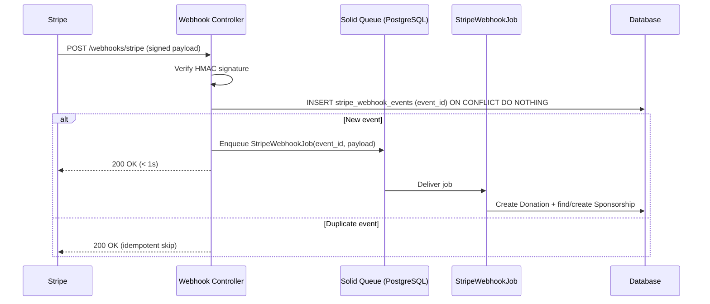
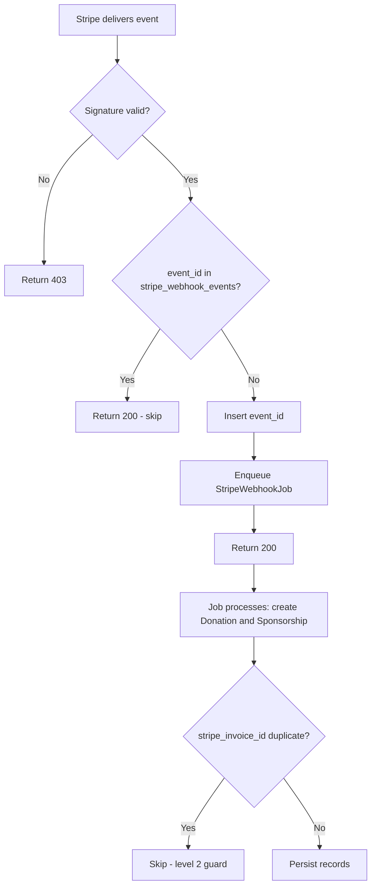

# ADR – Stripe Webhook Handler Architecture

> Choose how the system receives, verifies, and processes Stripe payment events reliably once webhook integration (TICKET-026) replaces CSV import.

---

## Status

`proposed` — Michael to decide.

## Created

2026-06-24

## Suggested decision date

2026-07-07 — TICKET-026 (Stripe webhook integration) is the highest-priority remaining Stripe epic item. The handler architecture must be decided before the ticket can be scoped and implemented.

---

## Context

Stage 1 confirmed Stripe webhook integration is the intended long-term path for real-time payment sync (BL-38). CSV import is retained only as an emergency recovery tool. Once live, every new payment will arrive via webhook rather than manual import.

Stripe delivers webhook events with at-least-once guarantees and retries for up to 72 hours using exponential backoff. If the endpoint does not respond within 10 seconds, Stripe marks the delivery as failed and retries. Out-of-order delivery is possible.

The system currently has no background job infrastructure. Redis and Sidekiq were explicitly removed to stay within the 1 GB RAM budget on the production droplet. Rails 8, which this project uses, ships Solid Queue as the default Active Job backend. Solid Queue stores jobs in PostgreSQL and requires no Redis.

The decision here covers two concerns: how to process events reliably (inline vs background job), and how to guarantee idempotency so retried events do not create duplicate records.

---

## Constraints

- The webhook endpoint must respond within 10 seconds or Stripe retries
- Stripe guarantees at-least-once delivery so duplicate events are expected
- The endpoint must verify Stripe's HMAC signature before doing any work
- The endpoint must be excluded from Rails CSRF protection
- The existing idempotency pattern on Donation records (stripe_invoice_id uniqueness) partially satisfies idempotency but a webhook-level guard is also needed
- Current volume is approximately 100-200 payment events per month with no concurrency

---

## Options considered

### Option A – Inline processing

Verify the signature, process the event synchronously within the request cycle (create Donation, create or find Sponsorship), and return 200. Guard idempotency by checking a `stripe_webhook_events` table before processing.

Pros:
- No additional infrastructure or migration beyond the events table
- Simple code path: controller action handles everything
- No separate job worker process needed
- At current volume (100-200 events/month, non-concurrent), processing time is well under 10 seconds per event

Cons:
- If processing takes unexpectedly long (database slowness, external call), Stripe retries the delivery unnecessarily
- No retry mechanism if the processing code throws after the 200 has been returned
- Harder to add processing complexity later without restructuring

### Option B – Solid Queue background job *(Claude's recommendation)*

Verify the signature and enqueue a job immediately. Return 200 within milliseconds. The job handles all business logic (create Donation, find or create Sponsorship, update source field). Solid Queue stores the job in PostgreSQL, no Redis required.

Pros:
- Response time is deterministic: signature check plus one DB insert, always well under 10 seconds
- Jobs are durable: if the worker crashes mid-job, Solid Queue retries from the queue
- Idempotency is enforced at two levels: webhook-level (events table) and job-level (Solid Queue deduplication)
- Clean separation between receiving events and processing them
- Rails 8 default: no new infrastructure, just run `bin/jobs` alongside Puma
- Standard production pattern recommended by Stripe and the wider Rails community

Cons:
- Requires running a job worker process (Solid Queue's `bin/jobs`)
- Adds a small amount of latency between event arrival and Donation record creation (seconds, not minutes)
- Additional Docker Compose service or supervisor config needed for the worker

### Research basis

Stripe documentation and multiple 2026 production guides recommend the enqueue-and-return-200 pattern: "Your webhook handler should do exactly one thing: validate the incoming event and enqueue it for processing." (Hookray, 2026)

Stigg engineering blog (production post-mortem): teams that processed inline hit timeout failures during database slowness and triggered unnecessary Stripe retries, causing duplicate processing attempts.

The idempotency table pattern uses a `stripe_webhook_events` table with a UNIQUE constraint on `stripe_event_id`. The database constraint guarantees only one job is enqueued even if two deliveries of the same event arrive simultaneously.

---

## Handler flow

---

## Idempotency pattern

Two-level guard regardless of which option is chosen:

1. **Webhook level:** `stripe_webhook_events` table with a unique index on `stripe_event_id`. Controller inserts before enqueuing. Concurrent duplicates are handled by the DB constraint.
2. **Donation level:** existing `stripe_invoice_id` uniqueness on `StripeInvoice` records (BL-15) catches any duplicate that bypasses level 1.

---

## Recommendation

**Claude recommends Option B – Solid Queue background job.**

The inline approach is technically sufficient at current volume, but it couples response time to database performance and leaves no recovery path if processing fails after the 200 is returned. Solid Queue is the Rails 8 default, requires no additional infrastructure beyond a second process running alongside Puma, and stores jobs in the existing PostgreSQL database with no RAM overhead beyond the worker process itself.

The pattern is: webhook controller verifies signature, inserts the event ID into `stripe_webhook_events` (catching duplicates at the DB layer), enqueues a `StripeWebhookJob`, and returns 200 immediately. The job contains all business logic for creating the Donation and Sponsorship records and tagging the source as `stripe_webhook` (BL-53).

First steps if Option B is chosen: add `stripe_webhook_events` migration with unique index on `stripe_event_id`, configure Solid Queue in `config/application.rb`, write `StripeWebhookJob` following the existing service object pattern, add the webhook route with CSRF skip, and test locally using `stripe listen --forward-to localhost:3001/webhooks/stripe`.

---

## Sources

- [Stripe Webhooks – Official Documentation](https://docs.stripe.com/webhooks) – signature verification, retry behaviour, and at-least-once delivery guarantees
- [Best practices I wish we knew when integrating Stripe webhooks](https://www.stigg.io/blog-posts/best-practices-i-wish-we-knew-when-integrating-stripe-webhooks) – production post-mortem covering inline processing failures and idempotency
- [Stripe Webhook Best Practices: Raw Body, Signatures and Retries](https://hookray.com/blog/stripe-webhook-best-practices-2026) – 2026 guide covering the enqueue-and-return pattern
- [Idempotent Stripe Webhooks](https://blog.adamzolo.com/idempotent-stripe-webhooks/) – Rails-specific idempotency table implementation
- [Handling Payment Webhooks Reliably (Idempotency, Retries, Validation)](https://medium.com/@sohail_saifii/handling-payment-webhooks-reliably-idempotency-retries-validation-69b762720bf5) – two-level idempotency pattern reference
- [Idempotent Webhook Consumers in Ruby on Rails](https://didit.me/blog/idempotent-webhook-consumers-ruby-rails-didit-events/) – Rails ActiveRecord implementation example

---

## Post-Decision

### Decision

2026-06-24. Option B – Solid Queue background job selected. Handler verifies signature, inserts to idempotency table, enqueues StripeWebhookJob, returns 200 immediately. No spike needed before implementation.

### Suggested review date

2026-09-24 – Three months after TICKET-026 ships and webhook integration is live in production. If job failures, duplicate events, or timeout retries are occurring, revisit the idempotency and retry configuration.

### Criteria for success

- Stripe delivers payment events and they appear as Donation records within seconds
- No duplicate Donation records from retried events
- Webhook endpoint consistently responds under 2 seconds
- Job failure rate below 1% in steady state

### Criteria for change

- Job queue depth grows consistently (indicates worker capacity problem)
- Stripe retries are observed in production logs (indicates response time issue)
- Out-of-order event delivery causes data integrity problems not covered by the two-level idempotency guard
