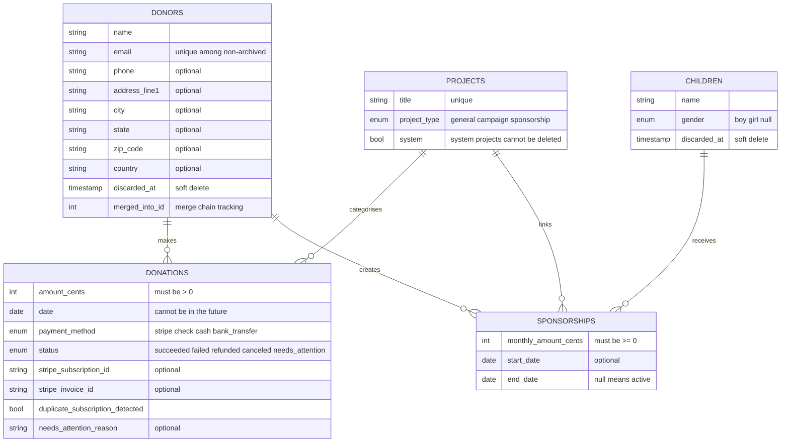

# Donation Tracker – Business Logic

Stage 1 artifact. Extracted from codebase, models, services, and ticket history. Pending Q&A review before Stage 2.

---

## System purpose

Single-admin web application for Projects for Asia (a children's home charity) to track donations, manage donor relationships, monitor child sponsorships, and reconcile payment data from Stripe. Deployed at donations.projectsforasia.com. Single-tenant.

---

## What this system does

- Records financial donations from donors to projects or sponsored children
- Tracks donor contact information and handles duplicate and merged donors
- Manages sponsored children and their ongoing donor-child sponsorship relationships
- Imports historical payment data from Stripe CSV exports
- Provides admin-only reports and data exports
- Manages project categories for donation classification
- Tracks full payment lifecycle including failed, refunded, and cancelled payments

## What this system does not do

- Accept donations from the public (no donor-facing UI, not planned)
- Process payments directly (Stripe handles payment processing)
- Send automated emails or notifications
- Support multiple organisations (single-tenant only)
- Provide public-facing content or fundraising pages
- Provide role-based access control beyond a single admin account
- Hard-delete any donor or donation records

---

## Actors

### Admin

Any authenticated user with a `@projectsforasia.com` Google account. Full read-write access to all data and operations. Single-tenant, so all admins share the same data.

Owns:
- All donor records (create, read, update, archive, merge)
- All donation records (create, read, update, delete within 24-hour window)
- All project records (create, read, update, archive) via Admin tab
- All child and sponsorship records
- Stripe CSV import and admin tools

### Anonymous Donors

No system access. Represented as Donor records only. Created automatically during Stripe CSV import when donor contact data is available but no email is present.

---

## Core data model

Five primary entities. Relationships summarised below.

---

## Business rules

### Donor rules

**BL-1** – A donor must have a name. Names default to "Anonymous" if blank.

**BL-2** – Email must be unique across all non-archived donors (case-insensitive). Archived donors are excluded from the uniqueness check.

**BL-3** – If no email is provided, an anonymous email is auto-generated in this priority order: phone number first (anonymous-5551234567@mailinator.com), then address components, then name only. The @mailinator.com domain identifies anonymous donors throughout the system.

**BL-4** – A donor cannot be hard deleted if they have any donations or sponsorships. Soft-delete (archive) is the only supported removal method.

**BL-5** – A donor cannot be archived if they have any active sponsorships. Active sponsorships must be ended or deleted first.

**BL-6** – Donor merge combines two or more donor records into a single new record. The admin selects which source donor provides each field (name, email, phone, address are individually selectable). All donations and sponsorships from the source donors are reassigned to the merged record. Source donors are soft-deleted with merged_into_id pointing to the new record.

**BL-7** – When looking up a donor by Stripe customer ID, the system follows the merge chain (via merged_into_id) to find the current active donor record.

**BL-8** – During CSV import, blank contact fields (phone, address) do not overwrite existing non-blank values on the donor record. The most recent transaction date wins for updates where both old and new data have values.

---

### Donation rules

**BL-9** – A donation must have a positive amount (stored in cents), a date not in the future, and a donor.

**BL-10** – Payment method is required on creation. Allowed values: stripe, check, cash, bank_transfer.

**BL-11** – Status values: succeeded (default), failed, refunded, canceled, needs_attention. All non-succeeded statuses appear in the admin Pending Review tab. Admin actions on Pending Review items: edit status to any value, edit the needs_attention_reason text, or archive/soft-delete the donation if it is invalid. No forced resolution flow. Items stay in the queue until the admin acts.

**BL-12** – A donation linked to a sponsorship-type project must also have a sponsorship_id. Direct donations to sponsorship projects without a sponsorship are rejected.

**BL-13** – When a donation is created with a child_id, the system auto-creates or finds an existing active sponsorship for that donor-child pair at the given monthly amount. The donation is linked to that sponsorship and its project.

**BL-14** – When a donation is created and the donor is archived, the donor is automatically restored (un-archived). Same behaviour for associated projects.

**BL-15** – Stripe imports are idempotent. A row is skipped if a StripeInvoice record with that stripe_invoice_id already exists.

**BL-16** – Duplicate subscriptions (same child appearing twice in a single invoice) are imported with status needs_attention and a reason field set to "Duplicate child in same invoice".

---

### Child rules

**BL-17** – A child must have a name. Gender is optional (boy, girl, or null).

**BL-18** – A child cannot be archived if they have active sponsorships.

**BL-19** – A child cannot be hard deleted if any sponsorships exist (active or ended).

---

### Sponsorship rules

**BL-20** – A sponsorship requires a donor, a child, and a monthly_amount >= 0. Zero is allowed for system-auto-created sponsorships. Manual creation via the UI should enforce > 0 (frontend validation).

**BL-21** – A sponsorship is active when its end_date is null. Setting end_date marks it as ended.

**BL-22** – Duplicate active sponsorships are not allowed. Two sponsorships are duplicates when they share the same donor, child, monthly_amount, and have no end_date. A single child may have active sponsorships from multiple different donors simultaneously (many-to-many relationship, intentional).

**BL-23** – On creation, if no project_id is provided, the system auto-creates a sponsorship-type project titled "Sponsor [child name]" or reuses an existing sponsorship project for that child. Each child has at most one sponsorship project.

**BL-24** – When a sponsorship is created and its donor, child, or project is archived, those records are automatically restored.

**BL-25** – A sponsorship cannot be hard deleted if it has any donations linked to it.

---

### Project rules

**BL-26** – Project titles must be unique. A project must have a title and a type.

**BL-27** – Project types are: general, campaign, sponsorship. Sponsorship projects are system-managed and are not user-selectable in create forms.

**BL-28** – The "General Donation" project is a system project (system: true) that is seeded on setup. System projects cannot be deleted or archived.

**BL-29** – A project cannot be archived if it has active sponsorships.

**BL-30** – A project cannot be hard deleted if it has any donations or sponsorships.

**BL-31** – In the Admin Projects tab, sponsorship projects are visible for review but the sponsorship type is not offered in the project create or edit form.

---

### Stripe import rules

**BL-32** – Email extraction priority during import: Cust Email column first, then Billing Details Email (fallback for rows where the primary column is empty), then auto-generated anonymous email from contact data.

**BL-33** – Child matching during import: metadata.child_id first (webhook format), then regex parsing of the plan nickname or description field using the pattern "Monthly Sponsorship Donation for [name]".

**BL-34** – Multiple children in a single invoice are supported via comma-separated names in the description field. Each child gets a separate donation record.

**BL-35** – Project matching during import: metadata.project_id first, then description pattern matching: general donation patterns map to "General Donation", "Donation for Campaign N" maps to "Campaign N", unrecognised descriptions create a new named project for admin review.

**BL-36** – Stripe payment status is mapped directly to the donation status field.

**BL-37** – When a new Stripe payment arrives for an ended sponsorship (same donor and child), a new Sponsorship record is created. The old ended record is kept as history. The donation timeline view (which months had payments) is derived from donation records, not from the sponsorship lifecycle.

**BL-38** – Stripe webhook integration is the intended long-term mechanism for real-time payment sync. CSV import is the current MVP approach and will be retired once webhooks are stable.

---

### Authentication rules

**BL-39** – Only @projectsforasia.com Google accounts may log in. Other accounts receive a 403 Forbidden response.

**BL-40** – JWT tokens expire after 30 days. All API routes require a valid token except /api/health, /auth/*, and /rails/health.

**BL-41** – A dev login endpoint is available in non-production environments for automated testing.

---

### Deletion and data retention rules

**BL-42** – Admins may delete a donation within 24 hours of creation. This is a soft policy for correcting accidental input errors. 24 hours is considered sufficient correction time.

**BL-43** – After the 24-hour window, a donation cannot be deleted through the normal UI. An admin override (TICKET-106) bypasses this for situations that require it. Override actions are admin-only.

**BL-44** – Donation and donor records are never hard-deleted from the database. Soft-delete (archive) is the only removal mechanism. Data is kept indefinitely.

---

### Reporting rules

**BL-45** – Donation reports are available in three formats: viewable in-app, downloadable as CSV, and downloadable as PDF. Admin selects a date range for each report.

**BL-46** – Three report types are planned: monthly (one row per donation), quarterly (consolidated per donor with gross and net amounts), and annual (year-end for tax records). All report types include only succeeded donations.

**BL-47** – Reports are available in two views: aggregate (all donors combined, for accounting and audit) and per-donor (one donor at a time, for giving to donors for their own records).

**BL-48** – Individual donor giving statements are PDF format. Admin selects a date range. Statements cover succeeded donations only and are intended for donor tax documentation.

**BL-49** – Stripe processing fees are tracked per transaction. A stripe_fee_cents field is stored on the Donation record (not on StripeInvoice), so reports can retrieve amount and fee in a single query without a join. Non-Stripe donations (cash, check, bank_transfer) have a null fee. The Stripe CSV Fee column must be captured on import.

**BL-50** – For donor-facing reports and giving statements, show the gross amount (what the donor paid, including any Stripe processing fee). For internal reports, show both gross and net amounts, either as separate columns or a toggleable view.

**BL-51** – Donor monthly amount changes are managed entirely in Stripe, not in this system. When a donor changes their sponsorship amount, the old Stripe subscription is cancelled and a new subscription is created at the new amount. The system handles this naturally: the old sponsorship ends when payments from the old subscription stop arriving, and a new sponsorship is created when the first payment from the new subscription is imported.

**BL-52** – The Sponsorship model does not store stripe_subscription_id. Multiple subscriptions from the same donor for the same child are acceptable as collapsed into one Sponsorship record. The donation-level history (individual payment records per month) is what matters for tracking, not a clean subscription-level history.

**BL-53** – Each Donation record stores a source field indicating how it was created: stripe_webhook (written by the webhook handler), stripe_csv (imported from Stripe CSV), or manual (entered by admin in the UI). Webhook-created donations are tagged stripe_webhook automatically by the system. This field is the mechanism by which Stripe-sourced records are identified.

**BL-54** – Sponsorship editing: manually entered sponsorships (no linked stripe_webhook donations) are fully editable by admin (all fields: donor, child, monthly_amount, start_date). Once Stripe webhook integration is live, sponsorships with stripe_webhook-sourced donations become read-only in the admin UI. Stripe CSV-sourced donations do not trigger the read-only lock. CSV import is a one-time mass-input and emergency recovery tool only. Once data was entered via CSV, admins may need to correct it manually because donor names and emails may have changed since the original import and the sheet reflects original values, not current system values.

**BL-55** – The monthly donation timeline view is surfaced in three places: per sponsorship (one donor for one child), per child (all sponsors across months), and per donor (all children they sponsor across months). Each view shows which months have succeeded donations and which are gaps.

**BL-56** – Check donations require only date and amount. No check number, deposit date, or bank reference tracking is needed.

**BL-60** – Donation record fields (amount, date, payment_method, project, sponsorship, child) are read-only in the admin UI when the donation's source is stripe_csv or stripe_webhook. Only two fields are editable on any donation regardless of source: status and needs_attention_reason (required for the Pending Review workflow, BL-11). Manual-sourced donations are fully editable.

**BL-61** – Donor attributes (name, email, phone, address) are always editable on the Donor record regardless of the source of any linked donations. Donation and sponsorship displays show the current live values from the Donor record via the foreign key relationship. No donor field values are frozen or snapshotted on the donation record at the time of import.

**BL-62** – All donation records that were previously imported via Stripe CSV must be back-filled with source = "stripe_csv" as part of the migration that adds the source column. Records created manually before the source column existed should be back-filled as "manual".

**BL-57** – A dashboard screen is required as the application landing page, replacing the current default Donations list. Dashboard includes: (a) six stat widgets: total active sponsorships, total active donors, children actively sponsored vs all non-archived children, total donated this month (gross), total donated this year (gross), and count of donations needing attention; (b) two charts covering the last 12 months by calendar month: count of donations per month, and net amount donated per month (amount minus Stripe fee; non-Stripe donations count as gross = net). Each widget and chart is individually toggleable per logged-in user. Toggle preferences are persisted per user in the database.

**BL-58** – Database backup is a required infrastructure concern. No application data is ever hard-deleted. The CSV import exists as a disaster-recovery re-import path and is retained in the Admin tab as a hidden emergency tool after Stripe webhooks go live.

**BL-59** – Each admin user has stored UI preferences. At minimum: which dashboard widgets are visible. Preferences are scoped to the individual user (not shared across all admins). Stored on the User record.

---

## User-facing surface

Single-page React application with these main sections:

| Section | URL | Purpose |
|---|---|---|
| Dashboard | / | Landing page with summary stats and 12-month chart (widgets toggleable per user) |
| Donations | /donations | Create, view, filter, and manage donation records |
| Donors | /donors | Manage donor records, merge duplicates, archive/restore |
| Children | /children | Manage sponsored children, archive/restore |
| Sponsorships | /sponsorships | View and manage donor-child sponsorship relationships |
| Admin | /admin | Pending review queue, CSV import/export, Projects management |
| Login | /login | Google OAuth login page |

---

## Security and privacy

- Authentication: Google OAuth 2.0 restricted to @projectsforasia.com domain
- Authorisation: single role (authenticated admin), no row-level permissions
- @mailinator.com emails are hidden from display and CSV exports to protect anonymous donor privacy
- Merged donor records (merged_into_id not null) are excluded from CSV exports
- JWT stored in browser localStorage; auto-logout on 401 response
- Input validation enforced on both frontend and backend
- Stripe CSV contains payment data; import is admin-only and runs server-side

---

## Error handling

- All non-succeeded donation statuses appear in the admin Pending Review tab for manual review
- Stripe import flags problematic rows with status and reason rather than silently skipping them
- Donor deduplication is manual (admin initiates merge)
- Archived entity auto-restoration on donation/sponsorship creation is automatic and silent
