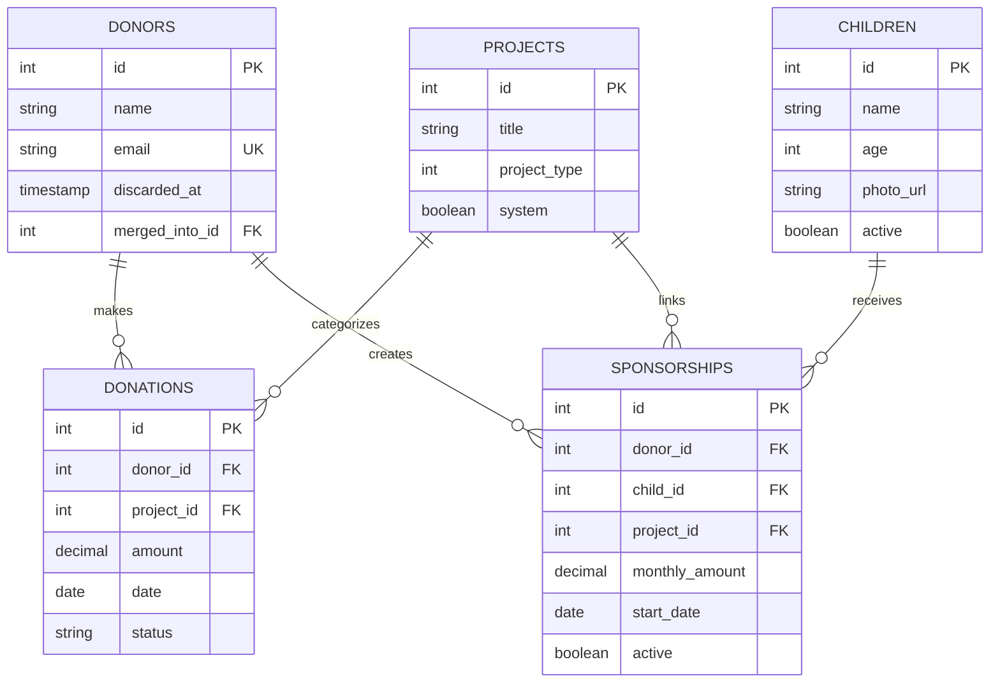

# Data Models

*Database schema and relationships*

---

## Implemented Models

### Users
- **Fields:** `id`, `email`, `name`, `role`, `google_id`, `created_at`, `updated_at`
- **Roles:** `super_admin`, `admin`, `read_only`
- **Authentication:** Google OAuth only
- **Status:** Partially implemented (username-only for TDD demo)

### Donors
- **Fields:** `id`, `name`, `email`, `phone`, `address`, `notes`, `discarded_at`, `merged_into_id`, `created_at`, `updated_at`
- **Validations:** Email uniqueness (case-insensitive), name presence
- **Features:** Soft delete (Discard gem), merge tracking, audit trail (PaperTrail)
- **Relationships:** `has_many :donations`, `has_many :sponsorships` (planned)
- **Status:** ✅ Complete

### Donations
- **Fields:**
  - `id`, `donor_id`, `project_id` (nullable)
  - `amount` (decimal, > 0), `date` (not in future)
  - `donation_type`, `payment_method`
  - `stripe_payment_intent_id` (nullable), `notes`
  - `recurring` (boolean), `frequency` (enum: monthly/quarterly/annually)
  - `last_received_date`, `expected_next_date`
  - `missed_payments_count` (integer, default: 0)
  - `status` (enum: active/late/overdue/at_risk/cancelled/paused)
  - `created_at`, `updated_at`
- **Donation Types:** general, project, sponsorship
- **Payment Methods:** stripe, check, cash, other
- **Relationships:** `belongs_to :donor`, `belongs_to :project` (optional)
- **Status:** ✅ Basic CRUD complete, recurring tracking planned

### Projects
- **Fields:** `id`, `title`, `description`, `project_type`, `system`, `created_at`, `updated_at`
- **Project Types:** `general` (0), `campaign` (1), `sponsorship` (2)
- **System Projects:** "General Donation" seeded with `system: true` (cannot be deleted/edited)
- **Relationships:** `has_many :donations`
- **Status:** ✅ Complete

---

## Planned Models (TICKET-010)

### Children
- **Fields:** `id`, `name`, `age`, `bio`, `photo_url`, `location`, `active`, `created_at`, `updated_at`
- **Relationships:** `has_many :sponsorships`
- **Status:** 📋 Planned for TICKET-010

### Sponsorships
- **Fields:** `id`, `donor_id`, `child_id`, `project_id`, `monthly_amount`, `start_date`, `end_date`, `active`, `created_at`, `updated_at`
- **Relationships:** `belongs_to :donor`, `belongs_to :child`, `belongs_to :project`
- **Note:** Many-to-many relationship (one donor can sponsor multiple children, one child can have multiple sponsors)
- **Design:** Each sponsorship creates a Project with `project_type: :sponsorship`
- **Donation Flow:** Donation → Project → Sponsorship → Child (linked via `project_id`)
- **Status:** 📋 Planned for TICKET-010

---

## Entity Relationship Diagram



---

## Database Indexes

**Implemented:**
- `donors.email` (unique, case-insensitive)
- `donations.donor_id` (foreign key)
- `donations.project_id` (foreign key, nullable)
- `projects.project_type` (enum lookup)

**Planned (TICKET-035):**
- `donations.date` (range queries, sorting)
- `donations.status` (filtering)
- `donations(donor_id, date)` (composite for common queries)

---

## Cascade Delete Strategy

**Policy:** Prevent accidental data loss by restricting deletion of models with dependent records.

### Project Deletion Rules (TICKET-038)

**Implementation:**
```ruby
class Project < ApplicationRecord
  has_many :donations, dependent: :restrict_with_exception
  has_many :sponsorships, dependent: :restrict_with_exception

  before_destroy :prevent_system_project_deletion

  def can_be_deleted?
    !system? && donations.empty? && sponsorships.empty?
  end
end
```

**Deletion Behavior:**
- **System projects**: Cannot be deleted (enforced by `before_destroy` callback)
- **Projects with donations**: Cannot be deleted (raises `ActiveRecord::DeleteRestrictionError`)
- **Projects with sponsorships**: Cannot be deleted (raises `ActiveRecord::DeleteRestrictionError`)
- **Empty projects**: Can be deleted safely

**Frontend Integration:**
- API includes `donations_count`, `sponsorships_count`, `can_be_deleted` fields via ProjectPresenter
- Delete button conditionally shown based on `can_be_deleted` status
- Prevents users from attempting impossible deletions

**Note:** Rails 8 uses `dependent: :restrict_with_exception` (not Rails 7's `restrict_with_error`)

### Future: Donor Deletion Rules

Donor cascade delete strategy deferred for future implementation (Part 1 of TICKET-038).

---

## Related Documentation

- **[API Endpoints](api-endpoints.md)** - REST API for these models
- **[Tech Stack](tech-stack.md)** - Database technology (PostgreSQL 15)
- **[Development Roadmap](roadmap.md)** - Implementation timeline
