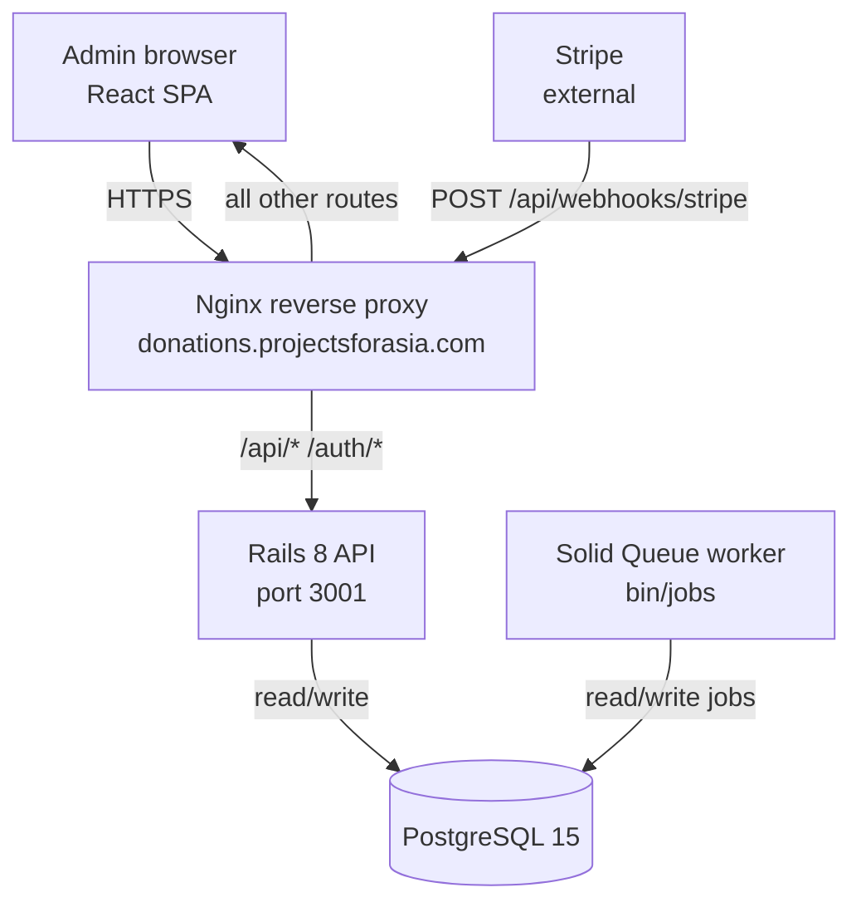
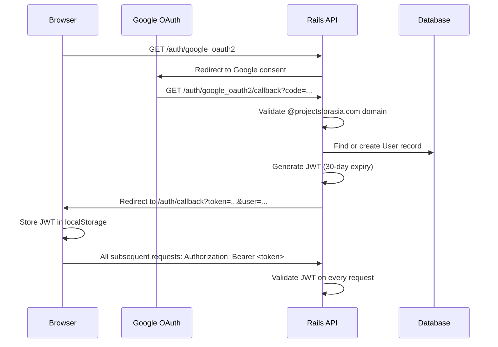

# Donation Tracker – Unified Spec

Stage 3 artifact. Synthesised from `docs/business-logic.md` (BL-1 through BL-59), the database schema, existing routes, ADR decisions, and codebase state as of 2026-06-24.

---

## 1. Architecture

### Component overview



### Technology stack

| Layer | Technology | Notes |
|---|---|---|
| Frontend | React 18, TypeScript, MUI, Axios | SPA, JWT in localStorage |
| Backend | Rails 8, Ruby, Puma | Single-mode (WEB_CONCURRENCY=0) |
| Database | PostgreSQL 15 | All persistent state including job queue |
| Job queue | Solid Queue (Rails 8 default) | No Redis. Runs as `bin/jobs` process. |
| Auth | Google OAuth2 + JWT | 30-day token expiry |
| PDF | Prawn + prawn-table | Pure Ruby, no binary deps (ADR decided 2026-06-24) |
| CSV import | StripePaymentImportService | Emergency recovery tool only |
| Webhooks | StripeWebhookJob via Solid Queue | Real-time payment sync (planned) |
| Hosting | DigitalOcean 1 GB droplet, Singapore | Docker Compose, Let's Encrypt |

### Containers (docker-compose.prod.yml)

| Container | Memory limit | Notes |
|---|---|---|
| postgres | 256 MB | PostgreSQL 15 |
| api | 220 MB | Rails + Puma + Solid Queue worker |
| nginx | – | Reverse proxy, SSL termination |

---

## 2. Data schema

### Current schema with planned migrations

All amounts are stored as integers representing cents. The `amount` and `monthly_amount` columns are typed `decimal` in the schema but hold integer cent values (e.g., 10000 = $100.00).

#### donors

| Column | Type | Constraints | Notes |
|---|---|---|---|
| id | bigint | PK | |
| name | string | required | Defaults to "Anonymous" if blank (BL-1) |
| email | string | unique index | Auto-generated @mailinator.com if absent (BL-3) |
| phone | string | optional | |
| address_line1 | string | optional | |
| address_line2 | string | optional | |
| city | string | optional | |
| state | string | optional | |
| zip_code | string | optional | |
| country | string | default "USA" | |
| discarded_at | datetime | nullable | Soft delete. Null = active. |
| merged_into_id | integer | nullable, FK donors | Merge chain tracking (BL-6, BL-7) |
| last_updated_at | datetime | nullable | Used during CSV import (BL-8) |
| created_at | datetime | | |
| updated_at | datetime | | |

Indexes: `email` (unique), `discarded_at`, `merged_into_id`.

#### donations

| Column | Type | Constraints | Notes |
|---|---|---|---|
| id | bigint | PK | |
| amount | decimal | required, > 0 | Integer cents (e.g., 10000 = $100.00) |
| date | date | required, not future | |
| donor_id | bigint | FK donors, required | |
| project_id | bigint | FK projects, optional | |
| sponsorship_id | bigint | FK sponsorships, optional | |
| child_id | integer | optional | Virtual attr on model, persisted for queries |
| payment_method | string | required | stripe, check, cash, bank_transfer |
| status | string | required, default "succeeded" | succeeded, failed, refunded, canceled, needs_attention |
| stripe_charge_id | string | optional | |
| stripe_customer_id | string | optional | |
| stripe_subscription_id | string | optional | |
| stripe_invoice_id | string | optional | |
| duplicate_subscription_detected | boolean | default false | |
| needs_attention_reason | text | optional | |
| description | text | optional | |
| **source** | **string** | **required, planned migration** | stripe_webhook, stripe_csv, manual (BL-53) |
| **stripe_fee_cents** | **integer** | **nullable, planned migration** | Null for non-Stripe payments (BL-49) |
| created_at | datetime | | |
| updated_at | datetime | | |

Indexes: `donor_id`, `project_id`, `sponsorship_id`, `child_id`, `date`, `status`, `payment_method`, `stripe_charge_id`, `stripe_customer_id`, `stripe_invoice_id`, `project_id+date` (composite).

**Required migrations:** add `source` (string, not null, default "manual"), add `stripe_fee_cents` (integer, nullable).

#### children

| Column | Type | Constraints | Notes |
|---|---|---|---|
| id | bigint | PK | |
| name | string | required | |
| gender | string | nullable | boy, girl, or null |
| discarded_at | datetime | nullable | Soft delete |
| created_at | datetime | | |
| updated_at | datetime | | |

Indexes: `discarded_at`.

#### sponsorships

| Column | Type | Constraints | Notes |
|---|---|---|---|
| id | bigint | PK | |
| donor_id | bigint | FK donors, required | |
| child_id | bigint | FK children, required | |
| project_id | bigint | FK projects, required | Auto-created if absent (BL-23) |
| monthly_amount | decimal | required, >= 0 | Integer cents |
| start_date | date | optional | |
| end_date | date | nullable | Null = active (BL-21) |
| created_at | datetime | | |
| updated_at | datetime | | |

Indexes: `donor_id`, `child_id`, `project_id`, `end_date`, composite uniqueness index on `donor_id+child_id+monthly_amount+end_date`.

Uniqueness constraint: no two active (end_date nil) sponsorships may share the same donor, child, and monthly_amount (BL-22).

#### projects

| Column | Type | Constraints | Notes |
|---|---|---|---|
| id | bigint | PK | |
| title | string | required, unique | |
| project_type | integer | required, default 0 | 0=general, 1=campaign, 2=sponsorship |
| description | text | optional | |
| system | boolean | default false | System projects cannot be deleted (BL-28) |
| discarded_at | datetime | nullable | Soft delete |
| created_at | datetime | | |
| updated_at | datetime | | |

Indexes: `title`, `project_type`, `system`, `discarded_at`.

#### stripe_invoices

| Column | Type | Constraints | Notes |
|---|---|---|---|
| id | bigint | PK | |
| stripe_invoice_id | string | required, unique | Idempotency key for CSV import (BL-15) |
| stripe_charge_id | string | required | |
| stripe_customer_id | string | optional | |
| stripe_subscription_id | string | optional | |
| total_amount_cents | integer | required | |
| invoice_date | date | required | |
| created_at | datetime | | |
| updated_at | datetime | | |

Indexes: `stripe_invoice_id` (unique), `stripe_charge_id`.

#### stripe_webhook_events (planned migration)

New table required for webhook idempotency (ADR decided 2026-06-24).

| Column | Type | Constraints | Notes |
|---|---|---|---|
| id | bigint | PK | |
| stripe_event_id | string | required, unique | Unique constraint prevents duplicate processing |
| processed_at | datetime | required | |
| created_at | datetime | | |

Index: `stripe_event_id` (unique).

#### users

| Column | Type | Constraints | Notes |
|---|---|---|---|
| id | bigint | PK | |
| provider | string | | google_oauth2 |
| uid | string | | Google UID |
| email | string | unique | Must be @projectsforasia.com |
| name | string | | |
| username | string | | |
| avatar_url | string | | |
| **preferences** | **jsonb** | **nullable, planned migration** | Per-user dashboard widget toggles (BL-59) |
| created_at | datetime | | |
| updated_at | datetime | | |

Indexes: `email` (unique), `provider+uid` (unique).

**Required migration:** add `preferences` (jsonb, default `{}`).

#### versions (PaperTrail audit trail)

| Column | Type | Notes |
|---|---|---|
| id | bigint | PK |
| item_type | string | Model name |
| item_id | bigint | Record ID |
| event | string | create, update, destroy |
| whodunnit | string | User identifier |
| object | text | Serialised pre-change state |
| created_at | datetime | |

---

## 3. API surface

All `/api/*` routes require `Authorization: Bearer <jwt>`. Exceptions listed in the security section.

### Auth

| Method | Path | Description |
|---|---|---|
| GET | /auth/google_oauth2/callback | OAuth callback. Validates domain. Returns JWT redirect. |
| GET | /auth/dev_login | Dev/test login. Returns JWT. Non-production only. |
| DELETE | /auth/logout | Clears session. |
| GET | /auth/me | Returns current user info. |

### Health

| Method | Path | Description |
|---|---|---|
| GET | /api/health | Returns 200. Auth not required. Used by E2E wait script. |
| GET | /up | Rails health check. |

### Donors

| Method | Path | Description |
|---|---|---|
| GET | /api/donors | List donors. Ransack filtering. Pagination. |
| POST | /api/donors | Create donor. |
| GET | /api/donors/:id | Show donor. |
| PATCH | /api/donors/:id | Update donor. |
| DELETE | /api/donors/:id | Soft-delete (archive) donor. Blocked if active sponsorships exist (BL-5). |
| POST | /api/donors/:id/restore | Restore archived donor. |
| POST | /api/donors/merge | Merge two or more donors (BL-6). |
| GET | /api/donors/export | CSV export of donor contact info and donation stats (BL-44 privacy filter). |
| DELETE | /api/donors/all | Destroy all (E2E test cleanup only, test env only). |

### Donations

| Method | Path | Description |
|---|---|---|
| GET | /api/donations | List donations. Ransack filtering. Pagination. |
| POST | /api/donations | Create donation. |
| GET | /api/donations/:id | Show donation. |
| PATCH | /api/donations/:id | **Planned.** Update status, needs_attention_reason. |
| DELETE | /api/donations/:id | **Planned.** Delete within 24-hour window (BL-42). Blocked for stripe_webhook source. |

### Projects

| Method | Path | Description |
|---|---|---|
| GET | /api/projects | List projects. Ransack filtering. |
| POST | /api/projects | Create project. Sponsorship type not allowed (BL-27). |
| GET | /api/projects/:id | Show project. |
| PATCH | /api/projects/:id | Update project. |
| DELETE | /api/projects/:id | Hard delete. Blocked if has donations or sponsorships (BL-30). |
| POST | /api/projects/:id/archive | Soft-delete. Blocked if has active sponsorships (BL-29). |
| POST | /api/projects/:id/restore | Restore archived project. |

### Children

| Method | Path | Description |
|---|---|---|
| GET | /api/children | List children. Ransack filtering. |
| POST | /api/children | Create child. |
| GET | /api/children/:id | Show child. |
| PATCH | /api/children/:id | Update child. |
| DELETE | /api/children/:id | Hard delete. Blocked if has any sponsorships (BL-19). |
| POST | /api/children/:id/archive | Soft-delete. Blocked if has active sponsorships (BL-18). |
| POST | /api/children/:id/restore | Restore archived child. |
| GET | /api/children/:id/sponsorships | List sponsorships for a child. |

### Sponsorships

| Method | Path | Description |
|---|---|---|
| GET | /api/sponsorships | List sponsorships. Ransack filtering. |
| POST | /api/sponsorships | Create sponsorship. Auto-creates project if needed (BL-23). |
| DELETE | /api/sponsorships/:id | Delete sponsorship. Blocked if has donations (BL-25). |
| PATCH | /api/sponsorships/:id | **Planned.** Update manual sponsorships. Read-only if stripe_webhook donations exist (BL-54, BL-55). |

### Search

| Method | Path | Description |
|---|---|---|
| GET | /api/search/project_or_child | Autocomplete search returning projects and children grouped. |

### Admin

| Method | Path | Description |
|---|---|---|
| POST | /api/admin/import/stripe_payments | CSV import. Multipart form. Returns status counts. |

### Reports

| Method | Path | Description |
|---|---|---|
| GET | /api/reports/donations | Donation report. Params: date_range, format (json/csv/pdf), scope (aggregate/per_donor). |
| GET | /api/reports/giving_statement | **Planned.** Per-donor giving statement PDF. Params: donor_id, start_date, end_date. |

### Dashboard (planned)

| Method | Path | Description |
|---|---|---|
| GET | /api/dashboard/stats | Returns all six stat widgets in one query. |
| GET | /api/dashboard/chart | Returns 12-month monthly data for count and net amount charts. |

### Webhooks (planned)

| Method | Path | Description |
|---|---|---|
| POST | /api/webhooks/stripe | Stripe event receiver. CSRF exempt. Signature verified before any processing. |

### User preferences (planned)

| Method | Path | Description |
|---|---|---|
| PATCH | /api/users/preferences | Update current user's dashboard widget preferences. |

---

## 4. UI surface

### Dashboard – /

Landing page after login. Replaces the current Donations list as default route.

Widgets (each individually togglable per user, preferences persisted to `users.preferences`):

| Widget | Data source | Notes |
|---|---|---|
| Total active sponsorships | `Sponsorship.active.count` | |
| Total active donors | `Donor.kept.count` | |
| Children sponsored / total | `Sponsorship.active.select(:child_id).distinct.count` vs `Child.kept.count` | |
| Total donated this month | `Donation.active.where(date: month_range).sum(:amount)` | Gross (BL-57) |
| Total donated this year | `Donation.active.where(date: year_range).sum(:amount)` | Gross (BL-57) |
| Donations needing attention | `Donation.pending_review.count` | Links to Admin Pending Review tab |

Charts (also togglable):

| Chart | Y-axis | Notes |
|---|---|---|
| Donations per month | Count of succeeded donations | Last 12 calendar months |
| Net amount per month | `amount - stripe_fee_cents` (non-Stripe: gross = net) | Last 12 calendar months |

### Donations – /donations

List of all donation records with filtering. Create new donations.

Key behaviours:
- Ransack filters: date range, donor, project, status, payment_method
- Pagination (25 per page)
- Create form: donor autocomplete, amount (dollars, frontend converts to cents), date, payment_method, project or child selector
- Edit: status and needs_attention_reason only (not amount or date once created)
- Delete: available within 24-hour creation window for non-stripe_webhook records (BL-42, BL-43, BL-54)
- Row click goes to donation detail

### Donors – /donors

List of donors. Create, edit, archive, restore, merge.

Key behaviours:
- Ransack filters: name, email, include_discarded
- Merge: select two donors, choose field sources, confirm
- Archive: blocked if active sponsorships exist (BL-5)
- Donor detail shows: contact info, donation history, active sponsorships, giving total
- CSV export button on list (excludes @mailinator.com emails and merged records per BL-44 privacy rules)

### Children – /children

List of children. Create, edit, archive, restore.

Key behaviours:
- Gender display: Boy / Girl / Unknown
- Archive: blocked if active sponsorships
- Child detail shows: profile, active sponsorships with monthly timeline view, all donors

### Sponsorships – /sponsorships

List of all sponsorships. Create, view, manage lifecycle.

Key behaviours:
- Filters: active only / all, donor, child
- Create: requires donor and child, sets start_date, monthly_amount
- Edit: available only for non-stripe_webhook sponsorships (BL-54)
- End: sets end_date on the record
- Delete: blocked if has any donations (BL-25)
- Monthly timeline view per sponsorship: grid of last 24 months, succeeded donation = filled cell, gap = empty (BL-55)

### Admin – /admin

Three tabs:

**Tab 0 – Pending Review**
- List of all donations with status != succeeded
- Actions per row: edit status, edit needs_attention_reason, archive (BL-11)
- No forced resolution. Items stay until admin acts.

**Tab 1 – CSV**
- Donor CSV export button (downloads donor contact + aggregate stats)
- Stripe CSV import: file picker, upload, shows result counts (imported, skipped, errors)
- Import is emergency-only; kept accessible but not promoted

**Tab 2 – Projects**
- Full project CRUD
- Sponsorship-type projects visible but not editable for type (BL-31)
- Archive / restore / delete with constraint enforcement

### Login – /login

Google OAuth sign-in button. Dev login button (non-production only).

---

## 5. Detailed workflows

### Workflow: Admin creates a manual donation

1. Admin navigates to /donations, clicks "New Donation"
2. Selects donor via autocomplete (debounced search)
3. Enters amount in dollars (frontend converts to cents via `parseCurrency`)
4. Selects date (not future)
5. Selects payment_method
6. Selects project OR child (mutually exclusive paths):
   - Project: picks from project autocomplete
   - Child: picks from child autocomplete, system auto-creates or finds sponsorship
7. Submits. `POST /api/donations` with `source: "manual"`
8. If donor is archived, system auto-restores (BL-14)
9. If child selected, system auto-creates Sponsorship if none exists (BL-13)
10. Donation record created with `source: "manual"`
11. Frontend shows success, refreshes list

### Workflow: Stripe webhook receives payment

1. Stripe sends `POST /api/webhooks/stripe` with signed payload
2. Controller excludes CSRF, verifies HMAC signature via `Stripe::Webhook.construct_event`
3. If signature invalid, return 403 immediately
4. Insert `stripe_event_id` into `stripe_webhook_events`. If UNIQUE constraint fails, return 200 (duplicate skip)
5. Enqueue `StripeWebhookJob(event_id, payload)`, return 200 within milliseconds
6. Job processes:
   - Extract donor by Stripe customer ID (follow merge chain per BL-7)
   - Extract or create Child via metadata or description parsing (BL-33)
   - Find or create Sponsorship for donor+child pair. If matching ended sponsorship exists, create new record (BL-37)
   - Create Donation with `source: "stripe_webhook"`, `stripe_fee_cents` from event fee field (BL-49, BL-53)
   - Create StripeInvoice for idempotency (BL-15)
7. Sponsorship linked to stripe_webhook-sourced donations becomes read-only in UI (BL-54)

### Workflow: CSV import (emergency recovery)

1. Admin goes to /admin, Tab 1 – CSV
2. Uploads Stripe CSV export file
3. `POST /api/admin/import/stripe_payments` (multipart)
4. StripePaymentImportService processes each row:
   - Extract email: Cust Email first, Billing Details Email fallback, then auto-generate (BL-32)
   - Find or create Donor (follow merge chain)
   - Extract Child from metadata or description (BL-33, BL-34)
   - Extract Project (BL-35)
   - Skip row if StripeInvoice with that stripe_invoice_id already exists (BL-15)
   - Create Donation with `source: "stripe_csv"`, `stripe_fee_cents` from Fee column (BL-49)
   - Mark duplicates needs_attention (BL-16)
   - Blank contact fields do not overwrite existing values (BL-8)
5. Response: `{ imported: N, skipped: N, errors: N }`

### Workflow: Donor merge

1. Admin finds two donor records (via search or duplicate list)
2. Clicks Merge on the primary donor
3. Selects second donor to merge into
4. UI shows side-by-side field picker: name, email, phone, address individually selectable
5. Admin confirms
6. `POST /api/donors/merge`
7. DonorMergeService:
   - Creates new merged donor record with chosen fields
   - Reassigns all donations from both source donors to new record
   - Reassigns all sponsorships from both source donors to new record
   - Soft-deletes both source donors, sets `merged_into_id` on each
8. All subsequent lookups follow merge chain (BL-7)

### Workflow: Monthly timeline view

Available in three contexts (BL-55):

**Per sponsorship** (on Sponsorship detail page): query `Donation.where(sponsorship_id:, status: :succeeded).group_by_month(:date)`. Render 24-month grid.

**Per child** (on Child detail page): query all succeeded donations linked to any sponsorship for this child, grouped by donor and month.

**Per donor** (on Donor detail page): query all succeeded donations for this donor across all sponsorships, grouped by child and month.

Query pattern: `SELECT date_trunc('month', date), COUNT(*), SUM(amount) FROM donations WHERE ... GROUP BY 1 ORDER BY 1`.

### Workflow: Generate donation report PDF

1. Admin goes to /admin or /reports
2. Selects report type (monthly/quarterly/annual), date range, scope (aggregate or per-donor)
3. Clicks Download PDF
4. `GET /api/reports/donations?format=pdf&start_date=&end_date=&scope=`
5. Controller calls DonationReportPdf service (Prawn)
6. Service builds PDF: header (org name, date range, report type), table of succeeded donations with columns for date, donor, amount, fee, net, project
7. For donor-facing scope: gross amount column only (BL-50)
8. For internal scope: gross and net columns both present (BL-50)
9. `send_data pdf.render, filename:, type: "application/pdf", disposition: "attachment"`

---

## 6. Security model

### Authentication flow



### Route protection

| Route pattern | Auth required |
|---|---|
| /api/health | No |
| /auth/* | No |
| /up | No |
| /api/webhooks/stripe | No (verified by Stripe signature instead) |
| All other /api/* | Yes |

### CSRF

Standard Rails CSRF protection applies to all routes. Exception: `POST /api/webhooks/stripe` must be excluded from CSRF middleware because Stripe cannot include a CSRF token.

### Domain restriction

Only @projectsforasia.com Google accounts succeed the OAuth flow. All other accounts receive 403 before a JWT is issued (BL-39).

### JWT

30-day expiry. Stored in browser localStorage. On 401 response, the API client interceptor automatically clears localStorage and redirects to /login.

### Input validation

All Ransack-filtered models maintain an explicit `ransackable_attributes` whitelist. No user-controlled column names reach the query layer.

Stripe webhook: raw body must be preserved for HMAC signature verification. Rails body parsers must not consume or re-encode the request body before the controller reads it.

### Privacy

@mailinator.com emails are never returned in CSV exports or public-facing reports (BL-44). Merged donor records (`merged_into_id` not null) are excluded from CSV exports.

---

## 7. Error catalogue

### Standard response shapes

**Success (200/201)**
```json
{ "donor": { ... } }
{ "donors": [ ... ], "meta": { "current_page": 1, "total_pages": 3 } }
```

**Validation error (422)**
```json
{ "errors": ["Name can't be blank", "Email has already been taken"] }
```

**Not found (404)**
```json
{ "error": "Couldn't find Donor with 'id'=999" }
```

**Bad request (400)**
```json
{ "error": "param is missing or the value is empty: donor" }
```

**Forbidden (403)**
```json
{ "error": "Domain not authorised" }
```

**Conflict (409)**
```json
{ "error": "Cannot delete: record has associated donations" }
```

### Specific error conditions

| Condition | HTTP status | Error message |
|---|---|---|
| Non-@projectsforasia.com login | 403 | "Domain not authorised" |
| Expired or invalid JWT | 401 | "Unauthorised" |
| Donor archive with active sponsorships | 422 | "Cannot archive donor with active sponsorships" |
| Child archive with active sponsorships | 422 | "Cannot archive child with active sponsorships" |
| Project archive with active sponsorships | 422 | "Cannot archive project with active sponsorships" |
| Delete donor with donations or sponsorships | 422 | "Cannot delete donor with associated records" |
| Delete child with sponsorships | 422 | "Cannot delete child with associated sponsorships" |
| Delete sponsorship with donations | 422 | "Cannot delete sponsorship with associated donations" |
| Duplicate active sponsorship | 422 | "[child name] is already actively sponsored by [donor name]" |
| Donation to sponsorship project without sponsorship_id | 422 | "Sponsorship_id must be present for sponsorship projects" |
| Donation amount <= 0 | 422 | "Amount must be greater than 0" |
| Donation date in future | 422 | "Date cannot be in the future" |
| Stripe webhook invalid signature | 403 | (no body) |
| Donation delete after 24-hour window | 422 | "Donation can no longer be deleted" |
| Edit stripe_webhook or stripe_csv donation fields | 422 | "Cannot edit a Stripe-managed donation" |

---

## 8. Test scenarios

### Donor creation and validation

| Scenario | Input | Expected |
|---|---|---|
| Valid donor with email | name: "Jane Doe", email: "jane@example.com" | 201, donor record created |
| No email provided | name: "Anonymous Donor", email: nil | 201, auto-generated mailinator email |
| Duplicate email | email of existing active donor | 422, "Email has already been taken" |
| Duplicate email with archived donor | email matching a discarded donor | 201, creates successfully (BL-2) |

### Donation creation

| Scenario | Input | Expected |
|---|---|---|
| Manual donation to project | amount, date, payment_method, donor, project | 201, source: "manual" |
| Donation with child_id | amount, date, donor, child_id | 201, sponsorship auto-created, source: "manual" |
| Donation to archived donor | existing archived donor_id | 201, donor auto-restored (BL-14) |
| Donation with future date | date: tomorrow | 422, "Date cannot be in the future" |
| Donation to sponsorship project, no sponsorship_id | project with type=sponsorship, no sponsorship_id | 422 (BL-12) |
| Stripe webhook donation | payment arrives via webhook | 201, source: "stripe_webhook", stripe_fee_cents populated |
| Duplicate webhook event | same stripe_event_id twice | Second delivery returns 200, no duplicate Donation created |

### Sponsorship lifecycle

| Scenario | Input | Expected |
|---|---|---|
| Create sponsorship | donor, child, monthly_amount | 201, sponsorship project auto-created |
| Duplicate active sponsorship | same donor+child+amount already active | 422, duplicate error |
| Delete sponsorship with no donations | sponsorship with zero donations | 200, deleted |
| Delete sponsorship with donations | sponsorship with one or more donations | 422 (BL-25) |
| Payment arrives for ended sponsorship | stripe payment where sponsorship.end_date not null | New sponsorship record created (BL-37) |
| Edit manual sponsorship | sponsorship with no stripe_webhook donations | 200, fields updated |
| Edit stripe_webhook sponsorship | sponsorship with at least one stripe_webhook donation | 422, read-only (BL-54) |

### Stripe CSV import idempotency

| Scenario | Expected |
|---|---|
| First import of CSV file | All rows processed, StripeInvoice records created |
| Re-import same file | All rows skipped (stripe_invoice_id already exists per BL-15) |
| CSV with empty Cust Email, populated Billing Details Email | Donor found/created via Billing Details Email (BL-32) |
| CSV with both emails empty | Anonymous email generated from contact data (BL-32) |
| Duplicate child in same invoice | Donation created with status needs_attention, reason: "Duplicate child in same invoice" (BL-16) |

### Dashboard stats

| Scenario | Expected |
|---|---|
| No donations this month | Total donated this month = 0 |
| Multiple sponsorships, one ended | Active sponsorship count excludes ended record |
| All children sponsored | Ratio shows 100% |
| Donations needing attention | Widget count matches pending_review scope |

---

## 9. Required schema changes

These migrations must be written before the tickets that depend on them can be implemented.

| Migration | Affects | BL/ADR reference | Urgency |
|---|---|---|---|
| Add `source` to donations | DonationReportPdf, webhook handler, CSV import, edit-lock logic | BL-53 | High – blocks TICKET-026 and TICKET-055 |
| Add `stripe_fee_cents` to donations | CSV import, webhook handler, reports | BL-49 | High – blocks report tickets |
| Add `preferences` to users | Dashboard widget toggle | BL-59 | Medium – blocks Dashboard epic |
| Create `stripe_webhook_events` | Webhook idempotency | ADR 2026-06-24 | High – blocks TICKET-026 |

---

## 10. Implementation decisions (resolved)

All open questions resolved 2026-06-24.

| ID | Decision |
|---|---|
| IQ-1 | Back-fill existing CSV-imported records as `source: "stripe_csv"`. Manually created pre-migration records back-filled as `source: "manual"`. stripe_csv and stripe_webhook both lock donation record fields (amount, date, payment_method, project) in the UI (BL-60). Donor attributes (name, email) remain editable on the Donor page and display live from the relationship everywhere donations are shown (BL-61). |
| IQ-2 | Solid Queue worker runs as a separate Docker Compose service (`bin/jobs`). Keeps API and worker independently restartable. Can be merged into the API container later if memory pressure warrants it. |
| IQ-3 | Single `/api/dashboard/stats` endpoint returns all six stat values. Frontend uses separate React components per widget. Each component reads from the same response object. |
| IQ-4 | Existing CSV fee conversion formula is correct. `(fee_string.to_f * 100).round.to_i`. No change to StripePaymentImportService needed beyond writing the result to the new `stripe_fee_cents` column. |
