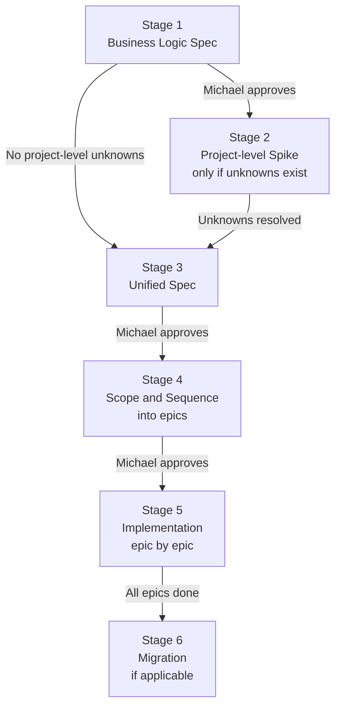

# {{PROJECT NAME}} — Development Process

Copy this template into `projects/active/<project-name>/development-process.md` when starting any software or automation project. Fill in the sections below as each stage completes. The process runs gate by gate. No stage begins until the previous gate is passed.

---

## Core principles

**Thin slicing.** Every epic and every ticket must deliver a thin, vertical strip of end-to-end functionality. Horizontal slices — "build all the data models," "build all the screens," "wire up all the integrations" — are prohibited. A thin slice touches every layer required to demonstrate a specific behaviour from input to output. If an epic or ticket cannot be shown working end-to-end, it is not thin enough.

**Automated testing as a first-class output.** Every piece of code has automated tests. Tests are not a follow-up step. A ticket is not complete until its automated tests pass. The level and type of testing is decided at the project level and confirmed at the epic and ticket level. See the testing strategy section in Stage 4.

**Rolling wave planning.** Only the current epic and its current ticket are fully detailed. Future epics are kept at meaningful-but-not-detailed — enough to understand the goal, dependencies, and size. Future tickets within the current epic carry a title and a one-liner. Detail is added just-in-time, immediately before work begins. Past epics and tickets are fully detailed because they were worked through in order.

---

## Stage overview

---

## Change propagation

When implementation reveals something that differs from the plan, changes bubble up through the hierarchy. Ticket findings can affect the epic. Epic findings can affect the spec. Spec changes can affect the business logic. Changes that permeate back down affect all remaining work at every level below them.

Michael weighs the trade-offs on any decision that affects scope or structure. Implementation decisions that stay within the agreed design are Claude's to make.

**Approval required**

| Change type | Notes |
|-------------|-------|
| Business scope — new or removed functionality | Any change to what the system does. Scope creep discovered during implementation always comes back for approval regardless of how small it appears. |
| Architecture — component structure, major technology choices, introduction of new external dependencies (libraries, services, APIs, platforms) | Shapes everything below it and is hard to reverse. New external dependencies are architectural decisions. |
| Security — authentication, authorisation, data exposure, input validation, encryption, session handling | Security decisions made during implementation that were not specced or that differ from the spec. |
| Interface or data schema changes that cross system or component boundaries | Breaking changes that affect multiple layers or external consumers. |
| Design decisions that change the user-facing or integration contract | Any surface the user or a collaborating system depends on, for any surface type (UI, API, CLI, event, etc.). |
| Breaking changes to existing behaviour | Reversing a delivered behaviour has downstream cost. |
| Major refactoring — structural rewrites without new functionality | High rework risk with diffuse impact. |
| Performance or feasibility constraint that changes what gets built | The spec promised something; the trade-off is Michael's to weigh. |

**Inform only**

| Change type | Notes |
|-------------|-------|
| Epic boundary adjustment | Scope moved between epics within the same plan. |
| Implementation detail | How something is built, within the agreed design and tech stack. |
| Internal code structure | Organisation, naming, module layout that does not affect interfaces. |
| Test strategy adjustment within a defined type | Adding extra fixture coverage, changing a test helper — unless it reduces coverage of a critical path. |
| Post-epic spec additions | Findings that add to the spec without contradicting a decided rule. Contradictions go back for approval at the affected level. |

**Documentation-first rule:** When implementation reveals a finding that affects scope, architecture, or a spec rule, update all affected documents first before writing any code that depends on the new information. The sequence is: finding → update docs → get approval if required (per Approval required table above) → continue implementation. Code written ahead of doc updates is a process violation.

---

## Stage 1 — Business Logic Spec

**Artifact** `business-logic.md`

**What it covers**
- What the system does and does not do
- Who the actors are and what each one owns
- The core data model
- The user-facing surface and its purpose (UI, API, CLI, automation, or combination — do not assume a type)
- All business rules governing system behaviour
- Security and privacy requirements
- Error handling rules
- Open questions for Michael to answer

**Review gate** Michael reads the doc and either approves it as written or requests corrections. This loop repeats until approved. No later stage begins before this gate passes.

**Definition of approved** Michael says "the business logic is approved" or equivalent.

**Status** Not started

---

## Stage 2 — Project-level Spike

**Artifact** Findings appended to `notes.md`

**When to run** Mandatory for any project that touches an external API, an undocumented system behaviour (OS-level API, third-party database, non-standard protocol), or a framework not previously used on this system. If all technical assumptions are confirmed and no external system is involved, skip directly to Stage 3. When in doubt, run the spike. Discovering an incompatibility here is cheaper than discovering it mid-epic.

**Spike scope — hierarchical**
Spikes are scoped to the level of the unknown. Run the smallest spike at the earliest point it is needed.

- Project-level (Stage 2): unknowns that, if wrong, would require rewriting the spec or business logic.
- Epic-level (before the epic begins): unknowns that affect the whole epic but not the whole project.
- Ticket-level (immediately before the ticket begins): unknowns that affect only that ticket.

A spike is the smallest test — a script, a curl call, a manual interaction, a throwaway prototype — that resolves the unknown. It produces a finding, not production code.

**How to run a project-level spike**
1. List every unconfirmed claim from Stage 1 that has project-wide impact.
2. Assign each a question ID (Q-impl-N) and a confidence level: assumed, unconfirmed, or confirmed.
3. Run the smallest possible test that confirms or refutes each claim.
4. Record findings in `notes.md`. Update `business-logic.md` if a finding contradicts an assumption. Contradictions at this level require Michael's approval before proceeding.
5. Move to Stage 3 when all project-level unknowns are resolved.

**Open questions to resolve before Stage 3**

| ID | Question | Confidence | Finding |
|----|----------|------------|---------|
| Q-impl-1 | {{question}} | unconfirmed | {{finding}} |

**Status** Not started / Skipped (no project-level unknowns)

---

## Stage 3 — Unified Spec

**Artifact** `spec.md`

**What it covers**
- Architecture diagram (data flow, component boundaries)
- Detailed workflows (step-by-step for each feature, command, screen, or API operation)
- Full data schemas with examples
- Surface contract — exact behaviour, output format, error states, and interaction model. Named and scoped to match what this project actually delivers: web UI, mobile app, desktop app, CLI, REST API, background service, or any combination. Not assumed to be any particular type.
- Security model — authentication, authorisation, data handling, input validation approach
- Error catalogue (every defined error condition and its behaviour)
- Test scenarios (representative inputs and expected outputs)
- Open implementation questions remaining after Stage 2

**Review gate** Claude drafts from the approved business logic. Michael reviews with focus on the surface contract, security model, and data schemas. Any change that conflicts with a business rule goes back to Stage 1 before being incorporated.

**Definition of approved** Michael says "the spec is approved" or equivalent.

**Status** Not started

---

## Stage 4 — Scope and Sequence

**Artifact** `implementation-plan.md`

**What it covers**
- Dependency graph across epics
- Per-epic entry with goal, rough area of the codebase, test signal, dependencies, and estimated size
- Ticket threshold decision
- Project testing strategy

---

### Thin slicing epics

Every epic must be a thin vertical slice. When reviewing the draft plan, check each epic against this rule: can it be demonstrated working end-to-end when it is done? If the answer is no, the epic is a horizontal layer and must be recut.

Thin slicing may mean starting with a reduced but complete feature (one list type instead of all list types, one operation instead of all operations) and expanding in later epics. Incomplete features are fine. Horizontal stacks are not.

---

### Ticket threshold

After reviewing all epics, decide whether any epic is complex enough to warrant breaking into tickets before implementation begins. Record the decision here. The decision is revisited at the start of each epic.

An epic warrants tickets when any of the following are true.

- The epic is estimated at more than two sessions
- The spec leaves significant implementation-level decisions open within the epic
- The epic introduces a new external system, framework, or platform not used in earlier epics
- Multiple people or agents are implementing in parallel

If an epic needs tickets, they are scoped and sequenced at the start of that epic, not upfront for all epics.

---

### Project testing strategy

Decide at the project level which test types apply. Record the decision here and reference it at the epic and ticket level.

**Test type reference**

| Test type | When it applies |
|-----------|----------------|
| Unit | Always. Any function or component with logic. Pure functions in particular. |
| Integration | When multiple components interact — service layer plus database, file I/O plus parsing, API plus auth. |
| System / E2E | When a user flow needs validation from input to output. Full CLI invocation for CLI tools. Browser automation for web. |
| Acceptance / functional | When user-facing behaviour must be verified against the acceptance criteria. Can be automated or a documented manual test plan. |
| Contract | When two services or systems integrate via an API. Verifies the interface from both sides. |
| Non-functional: performance | When throughput, latency, or resource consumption is specified or affects usability. |
| Non-functional: security | When the threat model includes external inputs, sensitive data, or authenticated surfaces. |
| Smoke | A quick sanity check on the critical path after each deploy or major change. |

**Common profiles**

| Project type | Typical test types |
|---|---|
| CLI tool / automation | Unit, integration, system (full CLI invocation) |
| REST API | Unit, integration, contract, functional, security |
| Web application | Unit, integration, system/E2E, acceptance, security, performance |
| Mobile application | Unit, integration, system/E2E, acceptance, non-functional (device) |
| Background service | Unit, integration, system, functional |

**For projects with a JavaScript frontend:** the JS testing strategy is a required explicit decision here, not an implicit omission. Specify the JS unit testing tool (Vitest is recommended, no build step required), the scope of JS unit tests (pure functions, event handlers, state management), and the E2E approach (automated or manual, with clear conditions for when automation is added). A decision of "manual only" is valid but must be recorded. An implicit omission means quality relies entirely on manual verification, which is not an acceptable outcome.

**Decision for this project**

Testing types applied: {{list the types}}

Rationale: {{one sentence on why this profile fits the project}}

---

---

### Code style guide

Create `code-style.md` in the project folder using `templates/code-style.md`. At project start it contains only the universal principles (SOLID, DRY, KISS, YAGNI), the linter and formatter config with the commands to run them, and any naming conventions or patterns known upfront. Everything else — design patterns discovered during implementation, project-specific code smells, the refactoring log — accumulates as the project grows. The guide starts simple and matures with the project. Do not pre-fill sections that have no content yet.

---

### Design guide

For any project with a user-facing interface, create `design-guide.md` in the project folder. Adapt from `projects/active/obsidian-reminders/dashboard-design-guide.md` as a reference if no template exists. At project start the guide contains only design tokens (colours, spacing, typography), known interaction patterns, and accessibility requirements. Component patterns, discovered conventions, and anti-patterns accumulate as the UI matures. Do not pre-fill sections that have no content yet.

This file is required alongside `code-style.md` for any UI project. Stage 5 cannot begin without both existing.

**Review gate** Michael approves the epics, their sequence, the ticket threshold decision, the testing strategy, the initial code style guide, and the design guide stub (for UI projects). All three artifact stubs must exist before Stage 5 begins.

**Definition of approved** Michael says "the plan is approved" or equivalent.

**Status** Not started

---

## Stage 5 — Implementation

**Artifact** Code, tests, and supporting files in `epics-and-tickets/`

Each epic has its own file in `epics-and-tickets/`, created from `templates/epic.md`. Each ticket has its own file there too, created from `templates/ticket.md`. Change propagation (ticket → epic → spec → business logic, and back down) follows the Change propagation table above.

---

### Working an epic

**Step 1 — Refine the epic**
Create the epic file in `epics-and-tickets/` from `templates/epic.md`. Bring it to full detail before writing any code.

**Step 2 — Epic-level spike (if needed)**
If there are unknowns that affect the whole epic and were not resolved in Stage 2, run a spike now. Record findings in `notes.md`. If the finding requires a spec or business logic change, follow the change propagation rules before continuing.

**Step 3 — Decide on tickets**
Apply the ticket threshold rule. If the epic does not need tickets, work it directly. If it does need tickets, go to Step 4. **When tickets are required, notify Michael at epic start: state how many tickets exist and that the first is being started. Stop when T1 is complete and wait for "continue" or "next ticket" before starting T2.**

**Step 4 — Scope and sequence tickets (if using tickets)**
Create ticket files in `epics-and-tickets/` from `templates/ticket.md`. **Always open `templates/ticket.md` directly before creating any ticket file.** Do not use a prior ticket file as a format reference — prior tickets may not follow the template and using them as references causes format drift. Apply vertical thin slicing: each ticket must deliver a demonstrable, end-to-end, independently testable behaviour. A ticket is not thin enough if it cannot be tested without waiting for a later ticket to complete. Future tickets carry a title and a one-liner in the epic file. The first ticket is fully refined before work begins. Subsequent tickets are refined one at a time, immediately before work starts on each.

**Refinement is grounded in the current codebase.** Before writing a ticket's refinement, read the relevant files to confirm the planning-level assumptions are still accurate. The codebase may have evolved since the pre-epic was written. A refinement written without reading the code is not valid.

**Step 5 — Work tickets one at a time**

For each ticket:
1. Refine the ticket by reading the relevant codebase files first. Fill in the Refinement section of the ticket file. Refinement happens immediately before the ticket begins, not upfront, and is always grounded in current code state.
2. Ticket-level spike (if needed) — run the smallest test that resolves any ticket-specific unknown. Record the finding. Follow the change propagation rules if the finding affects scope or architecture.
3. Implement.
4. Write and pass all automated tests required for this ticket before marking it done.
5. **Refactor.** With all tests green, review the new code for duplication, file size, naming clarity, and unnecessary complexity. Clean up before moving on. The test suite is the safety net — any red test during refactoring signals broken behaviour. This step is mandatory. Skipping it accumulates technical debt that compounds across epics.
6. Complete the Post-ticket check in the ticket file.
7. **Stop and notify Michael that the ticket is complete.** Wait for "continue" or "next ticket" before refining and starting the next ticket.

---

### Epic status table

| Epic | Scope | Status | File |
|------|-------|--------|------|
| 1 — {{name}} | {{thin slice description}} | Not started | [[epics-and-tickets/epic-1-name]] |

---

## Stage 6 — Migration (if applicable)

This stage applies only when the project replaces an existing system that has live data or active workflows. Greenfield projects skip this stage entirely.

**Artifact** Migration log and updated production state

**What it covers**
- A dry-run against a copy of real data before touching production
- A backup of the existing state before any destructive operation
- A verification step that cross-references migrated state against live system state
- A rollback plan confirmed before the migration begins

**Status** Not applicable / Not started

---

## Known limitations

Record limitations accepted for v1 and deferred to a later version. Use this section to avoid re-litigating the same decisions in future sessions.

| ID | Limitation | Impact | Resolution path |
|----|-----------|--------|----------------|
| L1 | {{limitation}} | {{impact}} | {{path}} |

---

## Supporting resources

- `business-logic.md` — business rules, actor model, and security requirements
- `spec.md` — unified implementation spec
- `implementation-plan.md` — epic plan with dependency graph and testing strategy
- `code-style.md` — living code style guide: principles, linter config, patterns, smells, refactoring log
- `notes.md` — empirical findings and session log
- `migration-plan.md` — migration steps (Stage 6, if applicable)
